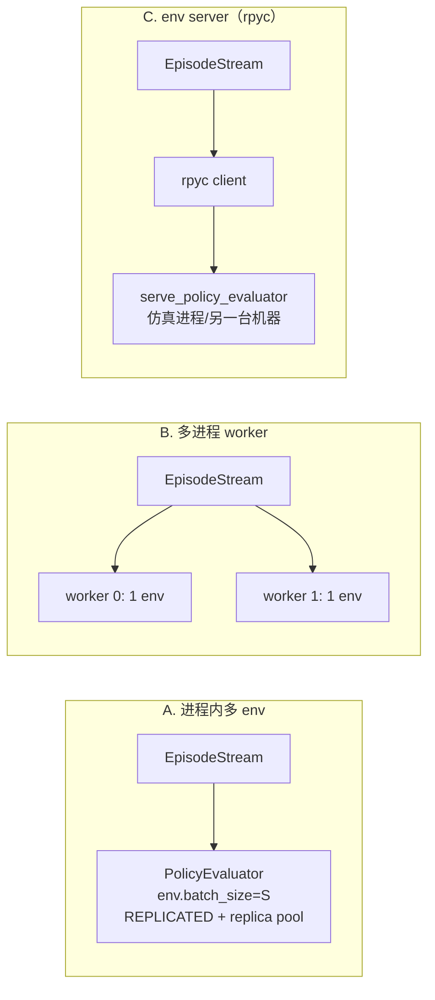

# AAO 流式 Data Loader 设计方案（提案，尚未实现）

> **状态：提案，尚未实现。**
>
> 本文描述把 AAO 的“按需生成 episode”能力收敛成一等公民**流式数据集 / 数据加载器**
> 的设计方向。当前仓库没有 `auto_atom/data` 包，也没有 `aao-stream` 入口；文中的
> 包路径、API、配置字段均为**拟议接口**，直接按本文调用会失败。
> 实现完成后按本仓库约定更新本文状态，或把稳定用法迁移到 `docs/tools/` 下的使用文档。

## 1. 背景与当前边界

仓库今天已经有两端，但缺少中间一层：

| 现状 | 定位 | 位置 |
|---|---|---|
| `TaskRunner` + `aao-demo` | 配置驱动的规则化任务执行（宏步进、interval selection） | `auto_atom/runtime.py`、`auto_atom/runner/demo.py` |
| `PolicyEvaluator` + `aao-eval` | 外部 policy 闭环执行，每个 control tick 一次 action | `auto_atom/policy_eval.py`、`auto_atom/runner/policy_eval.py` |
| `examples/record_demo.py` | 录一段 → 落盘 `npz`/`mp4`，**离线**、**有界** | `examples/record_demo.py` |
| `DataReplayRunner` | 反向：从 `npz`/`mcap` 读已有轨迹回放 | `auto_atom/runner/data_replay.py` |
| [Integrating AAO with External Data Collection Programs](../tools/external_data_collection.md) | 把“调度 episode / 映射 schema / 流式写出 / 重试”**整体留给 host collector** | 文档 |

宿主要做训练数据生产时，必须自己重写一遍同样的循环：slot 掩码调度、`done` 去重、
`success`/`truncated` 三态、观测按 env 切分、资源 `finally` 关闭。功能上可行，但这份
循环在每个宿主里各写一份，且没有统一的**确定性、分片、背压、失败治理**语义。

本提案补的就是这一层：**`for episode in aao.stream(...)`，可直接喂给训练循环的流式
数据源**，并在其上提供可选的 PyTorch `IterableDataset` 适配。

## 2. 目标与非目标

### 目标

1. **进程内可迭代**：不落盘即可 `for episode in stream`，逐 episode 或逐 transition 产出。
2. **可水平扩展**：worker 分片语义 `shard(worker_id, num_workers)`，与
   `torch.utils.data.DataLoader(num_workers=N)` 的 worker 语义对齐。
3. **Episode 级确定性**：`episode_index` → 可复现场景（随机化样本），与 worker 数、
   slot 顺序、是否 shuffle 无关。
   > 词汇边界：这里的 `episode` 属于**数据集层**（一集数据），它的一集边界就是
   > 一次 `reset()` 到下一次 `reset()`。仿真/后端/执行/配置层一律称"reset"，
   > 不叫 episode；两者是同一个边界的两个名字。

4. **有界内存**：有界队列 + 预取上限，内存不随运行时长增长。
5. **失败可治理**：随机化失败 / 超时 / 未完成 → 可配置跳过、重采样、抛错，且有熔断。
6. **采集与 schema 解耦**：AAO 侧只保证语义字段；落到具体训练框架命名的映射留在 adapter。

### 非目标（本提案不做）

- 不定义磁盘数据集格式（HDF5 / LeRobot / RLDS writer 仍由 host 或后续提案负责）。
- 不改变物理/控制语义，不改变 `TaskRunner` / `PolicyEvaluator` 的 update 粒度与成功判定。
- 不做分布式训练框架（Accelerate / Ray / Lightning）集成，只做 DataLoader 层。
- 不替 host 做输入队列 ack 语义（不引入任务队列、不引入优先级调度）。
- 不把 stream 塞进 `RunnerBase` 继承体系（见 §12）。

## 3. 可复用的现状边界

以下现状**直接复用**，不重复造：

| 现状 | 复用点 | 位置 |
|---|---|---|
| `reset(env_mask)` / `update(env_mask)` 掩码 API | slot 异步调度：某个 slot 完成立刻 `reset(slot_mask)` 开新 episode，不等最慢的 slot | `auto_atom/runner/base.py`、`auto_atom/runtime.py`、`auto_atom/policy_eval.py` |
| `ObservationEnvProtocol.capture_observation()` | 观测结构 `{key: {"data": batched, "t": batched}}`，含 `action/...` 命令侧通道 | `auto_atom/contracts.py`、`auto_atom/basis/mjc/mujoco_env.py` |
| `TaskUpdate` | 每步语义标签：`stage_index` / `stage_name` / `phase` / `phase_step` / `done` / `success` / `details` | `auto_atom/runtime.py` |
| `ExecutionRecord` | stage 级事件流（成功/失败原因、操作、目标物体） | `auto_atom/execution_model.py` |
| `ConfigDrivenDemoPolicy` + `PolicyEvaluator` | 唯一生产者路径：demo 与 `TaskRunner` 有 parity 测试保证一致 | `auto_atom/policy_eval.py`、`tests/test_demo_eval_parity.py` |
| `_collect_reset_details` | reset 后的初始场景真值（物体/操作器/相机位姿） | `auto_atom/runtime.py` |
| `get_reset_diagnostics(env_index)` | 本次 reset 实际采样出的偏移（场景级 ground truth） | `auto_atom/backend/mjc/mujoco_backend.py` |
| `BatchExecutionAdapter` + REPLICATED replica pool | 进程内批内并行 | `auto_atom/basis/mjc/batch_execution.py`、`env.parallel_batch_step` |
| `auto_atom.ipc`（rpyc） | 跨进程/跨机：仿真留在 server，客户端只消费序列化 dict | `auto_atom/ipc/` |

## 4. 核心抽象

### 4.1 数据单元：`Transition` 与 `Episode`

```python
# auto_atom/data/records.py   （拟议）
@dataclass
class Transition:
    obs: dict[str, np.ndarray]        # 已去掉 batch 维；key 与 capture_observation 一致
    action: dict[str, np.ndarray]     # 本 tick 实际下发的命令（见 §4.2 的“命令口径”）
    stage_index: int
    stage_name: str
    phase: str | None
    phase_step: int | None
    sim_time: float

@dataclass
class EpisodeArrays:
    """Columnar 形式：每通道一个 (T, ...) 数组，供 collate / 训练直接消费。"""
    obs: dict[str, np.ndarray]
    action: dict[str, np.ndarray]
    stage_index: np.ndarray
    phase_step: np.ndarray
    sim_time: np.ndarray

@dataclass
class Episode:
    episode_index: int
    seed: int
    task: str
    success: bool
    truncated: bool                # host 侧 max_updates 截断，与 success 独立
    failure_reason: str | None
    transitions: EpisodeArrays     # T = episode 长度
    initial_observation: dict[str, np.ndarray]
    scene: dict[str, Any]          # reset 后初始真值（物体/操作器/相机）
    randomization: dict[str, Any]  # 实际采样偏移（诊断/监督信号）
    records: list[ExecutionRecord]
    metadata: dict[str, Any]       # 配置名、overrides、worker_id、wall_time…

    def window(self, length: int, stride: int) -> Iterator["EpisodeArrays"]: ...
```

设计取舍：

- **columnar 优先**：逐 tick 的 `Transition` 对象开销大，`EpisodeArrays` 一次成型、
  可零拷贝切片；`Transition` 仅作为便利视图（`episode.transitions[i]`）。
- **`scene` 与 `randomization` 是显式字段**：随机化场景下的场景级监督（物体位姿真值、
  采样偏移）比像素更便宜也更有用，且它们是“每 episode 一个”的天然形状。
- **时间语义**：`sim_time` 来自观测的 `t`（`env.stamp_ns` 决定 ns 还是 s），
  沿用 [sim_freq & update_freq](../task-configuration/sim_freq_update_freq.md) 的约定。

### 4.2 生产者协议：`EpisodeSource`

```python
# auto_atom/data/source.py   （拟议）
class EpisodeSource(Protocol):
    def episodes(self) -> Iterator[Episode]: ...
    def close(self) -> None: ...
```

两个实现：

| 实现 | 基座 | 适用 |
|---|---|---|
| `EvaluatorEpisodeSource`（推荐主路径） | `PolicyEvaluator` + policy（`ConfigDrivenDemoPolicy` 或外部 policy） | 需要**逐 control tick 的 dense 数据**；action 即 policy 返回值，口径精确无歧义 |
| `RunnerEpisodeSource` | `TaskRunner` + `execution.update_boundary` | 只需要边界样本（primitive/keypoint/stage），用宏步进换吞吐 |

**命令口径（重要）**：训练数据里的 `action` 必须是“实际下发的命令”。

- `EvaluatorEpisodeSource`：`PolicyEvaluator.update(action)` 的 `action` 就是下发值，
  直接记录，无需额外 hook。
- `RunnerEpisodeSource`：下发值是内部 primitive 解析后的结果，只能从
  `TaskUpdate.details[env]["execution"]` / `ExecutionRecord` 侧读取；**宏步进会跳过中间
  tick**，所以 dense 数据必须用 `control_tick`（与
  [external_data_collection](../tools/external_data_collection.md) 的说明一致）。

因此默认建议：**用 `PolicyEvaluator` 作为唯一生产者**，`ConfigDrivenDemoPolicy` 提供与
`aao-demo` 等价的规则动作（已有 parity 测试），这样 demo 数据与 policy 数据走同一条代码路径。

### 4.3 调度层：`EpisodeStream`

```python
# auto_atom/data/stream.py   （拟议）
@dataclass
class StreamConfig:
    task: str                                  # → load_task_file_hydra(task, ...)
    overrides: list[str] = field(default_factory=list)
    observation_keys: list[str] | None = None  # None = 全通道
    policy: str | Callable = "demo"
    max_updates: int = 600
    sample_stride: int = 1                     # 每 k 个 control tick 采一帧
    batch_size: int = 1                        # 进程内 slot 数（→ env.batch_size）
    on_invalid: Literal["resample", "keep", "raise"] = "resample"
    retry_budget: int = 3
    queue_size: int = 16                       # 背压上限
    base_seed: int = 0

class EpisodeStream(Iterator[Episode]):
    def shard(self, worker_id: int, num_workers: int) -> "EpisodeStream": ...
    @property
    def stats(self) -> "StreamStats": ...      # 成功/失败/跳过/截断计数、步数分布、吞吐
    def close(self) -> None: ...
    def __enter__(self) -> "EpisodeStream": ...
    def __exit__(self, *exc) -> None: ...
```

调度语义：

- **slot 异步**：`batch_size = S` 个 slot，每个 slot 独立跑 episode。slot 完成后立刻
  `reset(该 slot 掩码)` 开新 episode，用 `handled` 掩码对 `done` 去重（沿用
  [external_data_collection](../tools/external_data_collection.md) 的告警：`done=True`
  会一直可见直到该 env 被 reset）。
- **产出口径**：默认按 **episode** 产出（IL 场景下整条轨迹是样本最小单位，且
  `success`/`scene`/统计都需要整条轨迹）。**transition 级流式**通过
  `stream(level="transition")` 提供，供在线 RL 使用，代价是同一 episode 的元数据要
  在流中重复携带。
- **分片**：`episode_index = worker_id + k * num_workers`。分片只影响“生成哪些
  episode_index”，不影响每个 episode 的内容（见 §5）。
- **背压**：内部有界 `queue.Queue(maxsize=queue_size)`；生产者是后台线程/进程，
  消费者慢时生产自动阻塞，内存有界。

### 4.4 Adapter 层（训练框架侧）

```python
# auto_atom/integrations/torch_data.py   （拟议；torch 惰性导入）
class AaoIterableDataset(torch.utils.data.IterableDataset):
    """把 EpisodeStream 包装成 IterableDataset；按 torch worker 自动分片。"""

def collate_episodes(batch: list[Episode], *, max_len: int | None = None) -> dict[str, Any]:
    """变长 episode → padding + attention mask（或按 window 切成定长）。"""

def aao_worker_init(worker_id: int) -> None:
    """在 worker 内构造/绑定 EpisodeStream 并调用 shard(worker_id, num_workers)。"""
```

用法（拟议）：

```python
from torch.utils.data import DataLoader
from auto_atom.data import EpisodeStream, StreamConfig
from auto_atom.integrations.torch_data import AaoIterableDataset, collate_episodes

def make_stream() -> EpisodeStream:
    return EpisodeStream.from_config(StreamConfig(
        task="pick_and_place",
        overrides=["env.viewer.disable=true", "+env.parallel_batch_step=true"],
        batch_size=1,
    ))

ds = AaoIterableDataset(make_stream, window=32, transform=to_model_dtype)
loader = DataLoader(ds, batch_size=8, num_workers=4, prefetch_factor=4,
                    persistent_workers=True, collate_fn=collate_episodes)

for step, batch in enumerate(loader):
    train_step(batch)
```

关键点：

- **`num_workers > 0` 用 spawn**（`multiprocessing.get_context("spawn")`）。MuJoCo + GL +
  线程池经 `fork` 极不安全；每个 worker 进程必须自己构造 env（设备/`MUJOCO_GL` 在构造前
  设定，见 [MuJoCo EGL 排障](../troubleshooting/mujoco-egl-troubleshooting.md)）。
- **变长处理**两条路：`collate_episodes` 做 padding + mask（保留整条 episode 语义），
  或 `window=k` 切成定长片段（避免 padding 浪费，适合 chunk 型策略）。两者都提供。
- **大图跨进程**：`capture_observation` 的图像经 pickle 有成本；可选
  `multiprocessing.shared_memory` 传引用（拟议 `transport="shm"`），或由 worker 直接落盘
  + 训练侧 mmap。
- **核心包零 torch 依赖**：`auto_atom` 目前只有 GS 后端用 torch；`integrations/` 下必须
  惰性 import，`import auto_atom` 不得因此变重。

## 5. 确定性、分片与可恢复性

这是本方案里**唯一需要改动现有实现语义**的部分，也是必须先决策的部分。

### 现状（基于代码事实）

- `MujocoTaskBackend._rng = np.random.default_rng(random_seed)`，是**顺序消费的随机流**。
- 每次 `backend.reset(...)` 都会 `_randomization_reset_index += 1`（**每次 reset 调用加一次，
  与掩码里几个 env 无关**）。
- 采样索引是 `sample_index = reset_index * 1009 + env_index`（`sample_pose_batch`）。
- **IID**（默认 generator）：`rng.uniform(...)` **顺序消费** → 样本取决于“这是第几次 reset”，
  而不是 `reset_index` 的数值本身。
- **QMC（Sobol）/ Poisson**：`unit_candidate(..., index=sample_index, seed=reset_index*1_000_003 + sample_index)`
  → 索引可寻址，但仍与 `rng` 状态混合。

推论：在 slot 异步调度下（不同 slot 的 reset 次数不同），**当前随机化无法做到
“episode_index 决定场景”**。样本内容与“reset 调用序列”强耦合。

### 方案 A（推荐，目标态）：episode 寻址的 RNG seam

```python
# auto_atom/contracts.py 上的新增可选能力（拟议）
class EpisodeSeededRandomizationProtocol(Protocol):
    def set_episode_rng(self, *, seed: int, episode_index: int) -> None:
        """把随机化 RNG 重置为“由 (seed, episode_index) 派生”的确定性状态。"""
```

语义：

- `self._rng = np.random.default_rng(derive(seed, episode_index))`；
- `self._randomization_reset_index = episode_index`（使 QMC/Poisson 的索引寻址也一致）；
- `derive` 必须是纯函数（如 `seed * 1_000_003 + episode_index`，或 `SeedSequence.spawn`），
  且**不依赖 `env_index`**：slot 布局变化不应改变样本内容。

默认行为保持不变（顺序流），只在 `EpisodeStream` 内显式启用寻址模式，避免影响现有
`aao-demo rounds=N` 的复现性与随机化测试。

收益：

- `episode_index` 可乱序、可重放、可跨 worker 迁移（恢复 = 记录已消费的 index 集合/水位）；
- worker 数从 4 改到 8 不改变“第 1000 个 episode 长什么样”。

代价：

- 现有“连续多轮 reset 的随机流”语义在启用该模式时改变，需要文档与测试同步；
- 各后端需实现该能力（`require_env_capability` 风格的 fail-closed：不支持的 backend
  在 `transport`/`determinism="episode"` 下直接报错，而不是静默退化为顺序流）。

### 方案 B（兼容态）：顺序消费 + 游标恢复

不做 RNG 改动，接受“样本 = 第 N 次 reset 的结果”：

- 每 worker 顺序消费，不 shuffle；
- 恢复时记录 `(worker_id, num_workers, consumed_index)`，按 index 水位重放；
- worker 数变化即破坏可复现性。

保留为兜底：`StreamConfig(determinism="sequential")`。若实现周期紧张，可先落 B，
但**接口按 A 设计**（`determinism` 字段 + protocol），避免后续返工。

## 6. 执行形态与选型



| 形态 | 吞吐 | 复杂度 | 适用 |
|---|---|---|---|
| A. 进程内多 env | 中（GPU 渲染可批内并行） | 低 | 单机、GPU 渲染（GS 批量渲染）、快速起步 |
| B. 多进程 worker | 高（CPU 密集、多核扩展） | 中 | 大吞吐数据生产、多 GPU |
| C. rpyc env server | 视网络 | 中高 | 训练与仿真分机；仿真机器独占 GL |

推荐落地顺序 **A → B → C**：`EpisodeSource` 做成 protocol，三种形态只是不同实现，
上层的 `EpisodeStream` / adapter 不变。

## 7. 背压与生命周期

- **有界队列 + 预取上限**，默认 `queue_size=16`；生产快于消费时自动阻塞。
- **关闭**：`close()` 必须在 `finally` / `__exit__` 调用，内部 `runner.close()` +
  `ComponentRegistry.clear()`（沿用 [external_data_collection](../tools/external_data_collection.md)
  的资源边界要求；`ComponentRegistry` 是类级单例，复用进程加载新任务前必须 clear）。
- **不要开 real-time sim loop**：`PolicyEvaluator.start_sim_loop()` 用于 viewer 联调；
  数据生产走显式 `update()` 驱动，否则吞吐被 60 Hz 限速。
- **不要 viewer**：`env.viewer=null`（或 `+env.viewer.disable=true`）。viewer 会强制
  `batch_size=1` 语义、刷新 `mjvScene`，并让 `parallel_batch_step` 失效。
- **信号处理**：SIGINT/SIGTERM → 置停止事件 → 消费者退出 → worker `finally` 关闭；
  避免留下持有 GL context 的僵尸进程。
- **每进程一个 GL context**：进程数 × env 数受 GPU/driver 限制，`num_workers` 需可配。

## 8. 失败与数据质量策略

`done` 与 `success` 独立（三态），沿用现有语义：

| 状态 | 处理 |
|---|---|
| `done=True, success=True` | 提交为成功 episode |
| `done=True, success=False` | 按 `on_invalid`：跳过 / 保留（带 `failure_reason`）/ 抛错 |
| `done=False` 且到 `max_updates` | `truncated=True`，按策略保留或丢弃 |

- **随机化失败**：现有语义是 fail-closed（`RandomizationFailureError`，见
  [Randomization](../task-configuration/randomization.md)）。在流式 loader 中这是
  “这个 episode 无效”，默认 `on_invalid="resample"`：同一 `episode_index` 用不同派生
  子种子重试，**最多 `retry_budget` 次**。
- **无限流的死循环风险（必须防）**：若任务配置本身不可行（100% 随机化失败或 100% 超时），
  `resample` 会永远重试。必须加**熔断**：连续 N 次无效 → 抛 `StreamUnhealthyError`
  并携带 `StreamStats`；同时 `stats` 里暴露有效率，供训练脚本 early-stop。
- **统计**：`StreamStats(episodes_emitted, invalid_skipped, retries, truncations,
  success_rate, steps_p50/p95, wall_time_per_episode, sim_time_per_episode)`。
- **不要让“跳过”静默改变分布**：跳过失败的 episode 会让训练集偏向成功样本；
  `stats` 与 `Episode.metadata` 必须保留被跳过样本的计数与原因，便于量化幸存者偏差。

## 9. 性能与吞吐

- **通道选择在 env 构造期决定**，不是每次 capture 动态裁剪：`env.enabled_sensors`
  （`DataType` 集合）与每相机 `enable_color/enable_depth/enable_mask/enable_heat_map`
  决定 `capture_observation()` 里出现哪些 key。为训练 schema 只开需要的通道，是最大
  的单点收益（相机渲染通常是主导成本）。
- **批内并行**：`env.parallel_batch_step=true` + `env.parallel_batch_workers`
  （REPLICATED 且无 viewer 时才生效；实测 batch=4 约 4×）。
- **`sample_stride`**：每 k 个 control tick 采一帧。注意语义区分：**命令仍然是每 tick
  下发**，只有样本帧被抽稀；若要做 `(obs_t, action_t, obs_{t+1})` 三元组，抽稀会导致
  `obs_{t+1}` 不是“下一 tick 的结果”，adapter 必须显式声明这件事（文档里已有同样的
  告警：时序 shift 在 adapter 内完成并单独测试）。
- **宏步进**：`execution.update_boundary=primitive/keypoint/stage` 能显著减少外部调用
  次数，但会丢中间帧；dense 数据必须保持 `control_tick`。
- **图像传输**：进程/网络边界上不要把 HWC uint8 大数组反复 pickle；优先 shm 或落盘 mmap。
- **基准脚本**：`benchmark_episode_stream.py`（拟议）输出 episodes/s、steps/s、
  GB/s、以及各阶段耗时占比（physics / render / capture / transmit），用于回答
  “该加 worker 还是该关相机”。

## 10. 与现有概念的边界

| 概念 | 是否被本提案取代 |
|---|---|
| `examples/record_demo.py` | 不取代。它产出**可视化 + 可回放**的 npz/mp4；stream 产出**训练样本**，不写可视化文件。 |
| `DataReplayRunner` | 不取代。它消费已有轨迹；stream 生产新轨迹。两者可组合（把回放数据也包成 `EpisodeSource`，做混合采样）。 |
| `external_data_collection.md` 的 host collector | **收敛**：文中“调度/映射/流式写出/重试”的通用部分由 `EpisodeStream` 承担；host 只剩“输入队列、ack、落盘格式”。实现后该文档的一节应指向 `docs/tools/streaming_data_loader.md`。 |
| `auto_atom.ipc` | 复用，不取代：作为形态 C 的传输层。 |

## 11. 分阶段实施计划（每轮独立提交、独立验证）

| 轮次 | 内容 | 验证 |
|---|---|---|
| **R1** | `auto_atom/data/` 骨架：`Episode`/`EpisodeArrays`/`Transition`/`StreamConfig` + `EvaluatorEpisodeSource`（单 env、同步、进程内） | `aao_configs/mock.yaml` 上的单测：episode 长度、标签对齐、T 与观测一致；不跑重仿真 |
| **R2** | recording seam：观测/命令/标签/`scene`/`randomization` 采集 + `success`/`truncated`/`failure_reason` 三态 + `StreamStats` | mock 后端测三态与非成功 episode 的字段完整性 |
| **R3** | `EpisodeStream` 调度：slot 掩码异步、`shard`、背压队列、`on_invalid` + `retry_budget` + 熔断 | 单测：多 slot 异步不串扰、`done` 去重、跳过计数正确；`retry_budget` 耗尽时抛错 |
| **R4** | 确定性：`EpisodeSeededRandomizationProtocol` + `determinism="episode"`（含 mock 与 mujoco 后端实现） | 单测：同 `episode_index` 不同 worker 数/顺序 → 场景一致；`determinism="sequential"` 行为与今日一致（随机化测试不回归） |
| **R5** | `integrations/torch_data.py` + 多进程 spawn worker pool（形态 B） | 冒烟：`num_workers=2` 下分片不重不漏；`collate_episodes` 变长 padding 正确；`import auto_atom` 不引入 torch |
| **R6** | 形态 C（rpyc，可选）、`aao-stream` CLI（可选，输出 stats/写盘）、基准脚本、文档迁移（design → `docs/tools/streaming_data_loader.md`） | 端到端示例 + `docs/` 引用检查 |

每轮按仓库约定用资源受限 runner 做定向验证：

```bash
/home/ghz/.mini_conda3/envs/airbot_play_data/bin/python scripts/run_tests_safe.py \
  --test-targets "tests/test_stream_<x>.py" --max-concurrency=1
```

## 12. 风险与取舍

| 风险 / 取舍 | 说明 | 处理 |
|---|---|---|
| **RNG 语义变更** | 方案 A 会改变“连续 reset 的随机流”，现有随机化复现性与测试对 reset 序列敏感 | 默认保持顺序流；寻址模式显式开启；不支持该能力的后端 fail-closed 报错 |
| **不把它做成 `RunnerBase` 子类** | stream 是 runner/evaluator 的**消费者**，不是执行语义的一部分；塞进继承体系会让 `runner/` 概念膨胀（`RunnerBase` 已是 `reset/update/close` 的抽象） | 独立 `auto_atom/data/` 包，只依赖 contracts + policy_eval |
| **变长 episode** | padding 浪费 vs 定长切窗丢跨窗上下文 | 两种都提供，由 adapter 选择；窗口型策略默认切窗 |
| **fork + GL** | 经典崩溃源（GL context / 线程池 / MuJoCo 状态） | 强制 spawn；worker 内自建 env；设备在构造前选择 |
| **torch 可选依赖** | 核心包不得因 stream 变重 | `integrations/` 惰性 import；CI 不强行安装 torch |
| **幸存者偏差** | `on_invalid="resample"` 静默改变数据分布 | `stats` + `Episode.metadata` 显式记录跳过原因与计数 |
| **确定性 vs 吞吐** | 严格 episode 寻址要求随机化只用派生 RNG，不能混用共享流 | 寻址模式下禁止在随机化路径消费共享 `_rng`；用测试锁定 |

## 13. 相关文档

- [Integrating AAO with External Data Collection Programs](../tools/external_data_collection.md) — 当前 host collector 边界的现状说明
- [Policy Evaluation](../tools/policy_evaluation.md) — `PolicyEvaluator` / `ConfigDrivenDemoPolicy` 接口
- [Data Collection](../tools/data_collection.md) — 离线录制与回放
- [Randomization](../task-configuration/randomization.md) — reset 随机化语义
- [Stages & Waypoints](../task-configuration/stages_and_waypoints.md) — 宏步进边界与 interval selection
- [Update Granularity Analysis](update-granularity-analysis.md) — update 粒度与内部观测 callback 的演进
- [MuJoCo EGL Troubleshooting](../troubleshooting/mujoco-egl-troubleshooting.md) — headless 渲染
