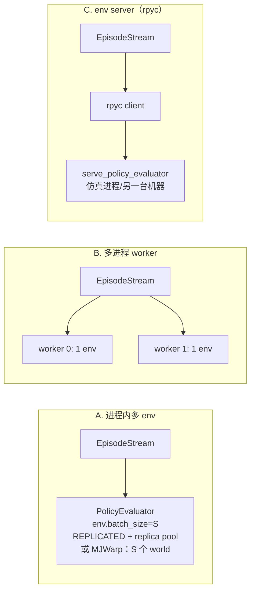

# AAO 流式 Data Loader 设计方案（R1–R4 已实现）

> **状态：R1–R4 已实现（`auto_atom/data/`），R5–R6 尚未实现。**
>
> 本文描述把 AAO 的“按需生成 episode”能力收敛成一等公民**流式数据集 / 数据加载器**
> 的设计。`auto_atom.data` 已提供 `EpisodeStream` / `StreamConfig` / `stream()`、
> 进程内 slot 异步调度、分片、背压、失败治理与按 `episode_index` 寻址的确定性；
> PyTorch adapter（`auto_atom/integrations/torch_data.py`）、多进程 worker pool、
> rpyc 形态、`aao-stream` CLI 与基准脚本仍是**拟议接口**。稳定后把用法迁移到
> `docs/tools/streaming_data_loader.md`（R6）。
>
> **实现与提案的差异**（正文已按实现更新）：
>
> - `EpisodeArrays` 多了 `tick`、`stage_name`、`phase` 三列。第 `t` 行是
>   `(tick 前的观测, 该 tick 的命令)`，第 0 行是 reset 后的观测；`Episode` 用
>   `final_observation`（最后一个 tick 之后）代替 `initial_observation`（§4.1）。
> - 目前只支持 demo policy：`StreamConfig.policy` 只能是 `"demo"`，没有 policy 工厂参数；
>   `action` 只记录环境的 `action/...` 命令通道（§4.2）。
> - `StreamConfig` 多了 `config_dir`、`num_episodes` 与 `on_retry_exhausted`：一个 index 的
>   重试用完默认跳过（`"skip"`），设为 `"raise"` 才抛 `RetryBudgetExhaustedError`（§8）。
>   transition 级流式（`level="transition"`）未实现。
> - env 新增 `capture_commands()`（`CommandObservationEnvProtocol`）：不渲染地读命令通道，
>   `sample_stride > 1` 时读命令不必多一次渲染（§9）。
> - 环境不报告命令通道时 stream 直接报错。MJWarp env 现在报告与原生相同的关节、EEF 与
>   命令通道；`execution=object_only` 的命令是被搬运物体的位姿与 carried 标志（§4.2）。
> - 寻址接口是 `set_reset_address(ResetAddress)`，协议 `AddressableResetHost` 在
>   `auto_atom/contracts.py`，是后端能力而非 `RandomizationHost` 的子协议；执行器从
>   host 的 `reset_address` 得知本次 reset 是否寻址（§5.4）。
> - 实现中又发现两处随调度变化的内容（§5.2 的 5、6）：多 slot 时 waypoint 随机化取的是
>   最近一次 reset 的流；相机噪声的帧号把为其他 slot 做的 capture 也算进去。两处都已修复。
> - 原生 MuJoCo 的 RGB 图像在同一状态下可能因此前渲染过的画面不同而差 1 个灰度级（§12）。
>
> **2026-10-08 按当前代码复核**：每次 reset 的随机流已改为只由“运行种子 + reset 编号”
> 派生（`auto_atom/utils/seed.py::reset_generator`），§5 据此重写，寻址剩下的工作随之变小；
> 新增 §4.5 说明哪些类型用 pydantic、哪些保留 dataclass；§3、§6、§9 补上 MJWarp 后端、
> `round_selection`、`object_only` 与观测配置组。

## 1. 背景与当前边界

仓库今天已经有两端，但缺少中间一层：

| 现状 | 定位 | 位置 |
|---|---|---|
| `TaskRunner` + `aao-demo` | 配置驱动的规则化任务执行（宏步进、interval selection） | `auto_atom/runtime.py`、`auto_atom/runner/demo.py` |
| `PolicyEvaluator` + `aao-eval` | 外部 policy 闭环执行，每个 control tick 一次 action | `auto_atom/policy_eval.py`、`auto_atom/runner/policy_eval.py` |
| `scripts/data/record_demo.py` | 录一段 → 落盘 `npz`/`mp4`，**离线**、**有界** | `scripts/data/record_demo.py` |
| `DataReplayRunner` | 反向：从 `npz`/`mcap` 读已有轨迹回放 | `auto_atom/runner/data_replay.py` |
| [Integrating AAO with External Data Collection Programs](../tools/external_data_collection.md) | 把“调度 episode / 映射 schema / 流式写出 / 重试”**整体留给 host collector** | 文档 |

宿主要做训练数据生产时，必须自己重写一遍同样的循环：slot 掩码调度、`done` 去重、
`success`/`truncated` 三态、观测按 env 切分、资源 `finally` 关闭。功能上可行，但这份
循环在每个宿主里各写一份，且没有统一的**确定性、分片、背压、失败治理**语义。

本提案补的就是这一层：**`for episode in aao.stream(...)`，可直接喂给训练循环的流式
数据源**，并在其上提供可选的 PyTorch `IterableDataset` 适配。

## 2. 目标与非目标

### 目标

1. **进程内可迭代**：不落盘即可 `for episode in stream`，逐 episode 或逐 transition 产出。
2. **可水平扩展**：worker 分片语义 `shard(worker_id, num_workers)`，与
   `torch.utils.data.DataLoader(num_workers=N)` 的 worker 语义对齐。
3. **Episode 级确定性**：`episode_index` → 可复现的 reset 场景，与 worker 数、slot
   顺序、是否 shuffle 无关。注意 reset 场景由**四条随机源**共同决定（场景随机化、
   waypoint 随机化、相机噪声、GS 背景），不是只有 `task.randomization`；详见 §5。
   > 词汇边界：这里的 `episode` 属于**数据集层**（一集数据），它的一集边界就是
   > 一次 `reset()` 到下一次 `reset()`。仿真/后端/执行/配置层一律称"reset"，
   > 不叫 episode；两者是同一个边界的两个名字。

4. **有界内存**：有界队列 + 预取上限，内存不随运行时长增长。
5. **失败可治理**：随机化失败 / 超时 / 未完成 → 可配置跳过、重采样、抛错，且有熔断。
6. **采集与 schema 解耦**：AAO 侧只保证语义字段；落到具体训练框架命名的映射留在 adapter。

### 非目标（本提案不做）

- 不定义磁盘数据集格式（HDF5 / LeRobot / RLDS writer 仍由 host 或后续提案负责）。
- 不改变物理/控制语义，不改变 `TaskRunner` / `PolicyEvaluator` 的 update 粒度与成功判定。
- 不做分布式训练框架（Accelerate / Ray / Lightning）集成，只做 DataLoader 层。
- 不替 host 做输入队列 ack 语义（不引入任务队列、不引入优先级调度）。
- 不把 stream 塞进 `RunnerBase` 继承体系（见 §12）。

## 3. 可复用的现状边界

以下现状**直接复用**，不重复造：

| 现状 | 复用点 | 位置 |
|---|---|---|
| `reset(env_mask)` / `update(env_mask)` 掩码 API | slot 异步调度：某个 slot 完成立刻 `reset(slot_mask)` 开新 episode，不等最慢的 slot | `auto_atom/runner/base.py`、`auto_atom/runtime.py`、`auto_atom/policy_eval.py` |
| `ObservationEnvProtocol.capture_observation()` | 观测结构 `{key: {"data": batched, "t": batched}}`，含 `action/...` 命令侧通道 | `auto_atom/contracts.py`、`auto_atom/basis/mjc/mujoco_env.py` |
| `TaskUpdate` | 每步语义标签：`stage_index` / `stage_name` / `phase` / `phase_step` / `done` / `success` / `details` | `auto_atom/runtime.py` |
| `ExecutionRecord` | stage 级事件流（成功/失败原因、操作、目标物体） | `auto_atom/execution_model.py` |
| `ConfigDrivenDemoPolicy` + `PolicyEvaluator` | 唯一生产者路径：demo 与 `TaskRunner` 有 parity 测试保证一致 | `auto_atom/policy_eval.py`、`tests/test_demo_eval_parity.py` |
| `_collect_reset_details` | reset 后的初始场景真值（物体/操作器位姿） | `auto_atom/runtime.py` |
| `get_reset_diagnostics(env_index)` / `get_camera_poses(env_index)` | 本次 reset 为什么难放，以及相机最终位姿（场景级 ground truth） | `auto_atom/contracts.py`、`auto_atom/backend/mjc/mujoco_backend.py` |
| `RandomizationHost`（可行性层能力协议） | 位姿读写、baseline、相机名/模型、支撑几何、`evaluate_pose_constraints`；`SceneBackend` 只留 `rng` / `get_camera_poses` / `get_reset_diagnostics` | `auto_atom/randomization_executor.py`、`auto_atom/contracts.py` |
| `_RecordingHost` 假 host | 只实现位姿读写就能跑完整一次 reset → **场景采样可脱离仿真器测试，甚至离线预生成** | `tests/test_randomization_executor.py` |
| `BatchExecutionAdapter` + REPLICATED replica pool | 进程内批内并行 | `auto_atom/basis/mjc/batch_execution.py`、`env.parallel_batch_step` |
| MJWarp 后端（`backend=warp`） | 进程内批内并行的 GPU 版：一个设备模型里 `batch_size` 个 world，按掩码 reset/step；在 pixi `warp` 环境运行 | `auto_atom/backend/mjwarp/`、`auto_atom/basis/mjwarp/` |
| `resolve_run_seed` / `reset_generator` | 每次 reset 的随机流只由 `(运行种子, reset 编号)` 决定，是 §5 寻址的现成基础 | `auto_atom/utils/seed.py` |
| `round_selection`（`+round_selection=...`） | 按编号复现第 N 轮的现成用例：跳过的轮次只 reset、不执行（仍要 reset，因为 reset 编号与非 IID 生成器的跨 reset 状态都靠它推进） | `auto_atom/runner/common.py` |
| `execution=object_only` | 不带操作器、按 stage 运动学搬运物体；只要场景与观测时的低成本生产者 | `aao_configs/execution/object_only.yaml` |
| `auto_atom.ipc`（rpyc） | 跨进程/跨机：仿真留在 server，客户端只消费序列化 dict | `auto_atom/ipc/` |

## 4. 核心抽象

### 4.1 数据单元：`Transition` 与 `Episode`

```python
# auto_atom/data/records.py   （为什么是 dataclass 见 §4.5）
@dataclass(frozen=True)
class Transition:
    obs: dict[str, np.ndarray]        # 已去掉 batch 维；key 与 capture_observation 一致
    action: dict[str, np.ndarray]     # 本 tick 实际下发的命令（见 §4.2 的“命令口径”）
    tick: int                         # 本 episode 内第几个 control tick（0 起）
    stage_index: int
    stage_name: str
    phase: str | None
    phase_step: int | None
    sim_time: float

@dataclass(frozen=True)
class EpisodeArrays:
    """Columnar 形式：每通道一个 (T, ...) 数组，供 collate / 训练直接消费。"""
    obs: dict[str, np.ndarray]
    action: dict[str, np.ndarray]
    tick: np.ndarray
    stage_index: np.ndarray
    stage_name: np.ndarray            # 字符串列；无 stage 为 ""
    phase: np.ndarray                 # 字符串列；无 phase 为 ""
    phase_step: np.ndarray            # 无 phase step 为 -1
    sim_time: np.ndarray

    def __post_init__(self) -> None:
        """校验所有列的首维是同一个 T：唯一值得在构造时检查的不变式。"""

@dataclass(frozen=True)
class Episode:
    episode_index: int
    seed: int
    task: str
    success: bool
    truncated: bool                # host 侧 max_updates 截断，与 success 独立
    failure_reason: str | None
    transitions: EpisodeArrays     # T = episode 长度
    final_observation: dict[str, np.ndarray]   # 最后一个 tick 之后的观测
    scene: dict[str, Any]          # reset 后初始真值（物体/操作器位姿 + 相机位姿）
    randomization: dict[str, Any]  # get_reset_diagnostics 的诊断（实际采样偏移、难放原因）
    records: list[ExecutionRecord]
    metadata: dict[str, Any]       # StreamConfig.model_dump(mode="json")、reset 编号、worker_id、wall_time…

    def window(self, length: int, stride: int) -> Iterator["EpisodeArrays"]: ...
```

**行语义**：第 `t` 行是一个 `(o_t, a_t)` 样本：`obs`、`sim_time` 是 control tick
`tick[t]` 决策时看到的观测（tick 之前采集；第 0 行是 reset 后的观测），`action` 是这个
tick 下发的命令，标签是 policy 决策时看到的 `TaskUpdate`（即命令所属的 stage）。训练侧
不需要再错行。最后一个命令执行后的结果是 `Episode.final_observation`。

`sample_stride = k` 时记录 tick `0, k, 2k, …`，`tick` 列写明是哪些 tick，每一行仍是
配对正确的样本。最后一个 tick 不再强制记录：一个 tick 是不是最后一个，要执行之后才知道，
而它的观测必须在执行之前采集。

命令通道只有在 tick 之后的采集里才报告这个 tick 的命令，所以记录的 tick 之后要读一次
命令。若这时本来就要做完整采集（下一个 tick 也记录、或 episode 结束），命令直接取自
那次采集；否则用不渲染的 `capture_commands()`（§9）。

设计取舍：

- **columnar 优先**：逐 tick 的 `Transition` 对象开销大，`EpisodeArrays` 一次成型、
  可零拷贝切片；`Transition` 仅作为便利视图（`episode.transitions[i]`），
  `episode.window(length, stride)` 给出定长视图。
- **`scene` 与 `randomization` 是显式字段**：随机化场景下的场景级监督（物体位姿真值、
  采样偏移）比像素更便宜也更有用，且它们是“每 episode 一个”的天然形状。
- **时间语义**：`sim_time` 来自观测的 `t`（`env.stamp_ns` 决定 ns 还是 s），
  沿用 [sim_freq & update_freq](../task-configuration/sim_freq_update_freq.md) 的约定。

### 4.2 生产者协议：`EpisodeSource`

```python
# auto_atom/data/source.py
class EpisodeSource(Protocol):
    def episodes(self) -> Iterator[Episode]: ...
    def close(self) -> None: ...
```

两个实现：

| 实现 | 基座 | 适用 |
|---|---|---|
| `EvaluatorEpisodeSource`（已实现，主路径） | `PolicyEvaluator` + policy。policy 是统称，可以是脚本 demo 策略或训练出的模型策略；目前只支持 `ConfigDrivenDemoPolicy` | 需要**逐 control tick 的 dense 数据** |
| `RunnerEpisodeSource`（未实现） | `TaskRunner` + `execution.update_boundary` | 只需要边界样本（primitive/keypoint/stage），用宏步进换吞吐 |

**命令口径（重要）**：训练数据里的 `action` 必须是“实际下发的命令”。

- `EvaluatorEpisodeSource`：记录环境在 tick 之后报告的 `action/...` 命令通道，按观测 key
  原样存放。`ConfigDrivenDemoPolicy` 返回的是 primitive 而不是数值，它下发的命令（经 IK
  之后）只出现在这些通道里。schema 因此只由环境决定，与 policy 无关。环境不报告任何
  `action/...` 通道时，stream 在第一次采集后直接报错，而不是产出没有动作的 episode。
- **physical 执行**：原生 MuJoCo 与 MJWarp env 报告同样的 key 与语义——
  `action/<limb>/joint_state/position`（执行器命令）与 `action/<operator>/pose/...`
  （本 tick 的 EEF 目标，base 系；`solve_once_interpolate` 下是最终 waypoint 位姿），
  状态侧是关节状态与 base 系 EEF 位姿。在 `pick_and_place`（mocap）与 `open_door`
  （airbot_play_g2p，per-step IK / solve_once_interpolate）上两后端 reset 帧差 < 1e-5，
  40 tick 内命令、臂关节与 EEF 位姿差 < 1e-3（`tests/test_mjwarp_observation_channels.py`）；
  夹爪接触后测得的开度差约 1 mm（MJWarp 没有 noslip）。MJWarp 只产出非 structured 布局，
  没有 IMU / wrench / tactile。
- **`execution=object_only`**：没有机器人，pick 逻辑上抓取 stage 物体、pose waypoint 运动学地
  搬运它。stream 为每个 pick stage 的物体加上状态 `<object>/pose/position|orientation`
  （世界系）、`<object>/carried`，以及命令 `action/<object>/pose/...`（reset 以来最后一次下发的
  世界系位姿，未下发时保持当前位姿）与 `action/<object>/carried`（pick 置 1、place 置 0）。
  命令由 `ExecutionContext.apply_object_pose` 记录，在 backend 之上实现，原生与 MJWarp 都有。
  搬运是运动学的，所以每个命令位姿就是下一帧观测到的位姿；这种模式不步进物理，
  `sim_time` 在 episode 内不变，行序看 `tick`。
- `RunnerEpisodeSource`：下发值是内部 primitive 解析后的结果，只能从
  `TaskUpdate.details[env]["execution"]` / `ExecutionRecord` 侧读取；**宏步进会跳过中间
  tick**，所以 dense 数据必须用 `control_tick`（与
  [external_data_collection](../tools/external_data_collection.md) 的说明一致）。

因此默认建议：**用 `PolicyEvaluator` 作为唯一生产者**，`ConfigDrivenDemoPolicy` 提供与
`aao-demo` 等价的规则动作（已有 parity 测试），这样 demo 数据与 policy 数据走同一条代码路径。

### 4.3 调度层：`EpisodeStream`

```python
# auto_atom/data/config.py   （为什么是 pydantic 见 §4.5）
class StreamConfig(BaseModel):
    model_config = ConfigDict(frozen=True, extra="forbid", use_attribute_docstrings=True)

    task: str                                  # → load_task_file_hydra(task, ...)
    base_seed: int                             # 必填：拒绝 None，0 是合法种子（见 §5.1）
    overrides: tuple[str, ...] = ()            # 不得含 task.seed / env.batch_size
    config_dir: str | None = None              # None = <cwd>/aao_configs
    observation_keys: tuple[str, ...] | None = None  # None = 全通道；命令通道总记录
    policy: Literal["demo"] = "demo"           # 目前只支持 demo policy
    max_updates: PositiveInt = 600
    sample_stride: PositiveInt = 1             # 记录 tick 0, k, 2k, …
    batch_size: PositiveInt = 1                # 进程内 slot 数（→ env.batch_size）
    num_episodes: PositiveInt | None = None    # 分片前的 episode_index 范围；None = 无限
    on_invalid: Literal["resample", "keep", "raise"] = "resample"
    retry_budget: NonNegativeInt = 3
    on_retry_exhausted: Literal["skip", "raise"] = "skip"   # §8
    max_consecutive_invalid: PositiveInt = 20  # 熔断阈值（§8）
    queue_size: PositiveInt = 16               # 背压上限
    determinism: Literal["episode", "sequential"] = "episode"

# auto_atom/data/stream.py
class EpisodeStream(Iterator[Episode]):
    @classmethod
    def from_config(cls, config: StreamConfig) -> "EpisodeStream": ...
    def shard(self, worker_id: int, num_workers: int) -> "EpisodeStream": ...
    @property
    def stats(self) -> "StreamStats": ...      # 成功/失败/跳过/截断计数、步数分布、吞吐
    def close(self) -> None: ...
    def __enter__(self) -> "EpisodeStream": ...
    def __exit__(self, *exc) -> None: ...
```

调度语义：

- **slot 异步**：`batch_size = S` 个 slot，每个 slot 独立跑 episode。slot 完成后立刻
  `reset(该 slot 掩码)` 开新 episode，用 `handled` 掩码对 `done` 去重（沿用
  [external_data_collection](../tools/external_data_collection.md) 的告警：`done=True`
  会一直可见直到该 env 被 reset）。
- **产出口径**：按 **episode** 产出（IL 场景下整条轨迹是样本最小单位，且
  `success`/`scene`/统计都需要整条轨迹）。**transition 级流式**（`level="transition"`，
  供在线 RL）尚未实现：它要在 episode 结束前就产出，与 `resample` 的“丢弃整条”冲突，
  需要单独设计。
- **分片**：`episode_index = worker_id + k * num_workers`。分片只影响“生成哪些
  episode_index”，不影响每个 episode 的内容（见 §5）。分片可以再分片
  （`shard(1, 2).shard(1, 3)` 即 6 份中的第 3 份），便于先按 rank 再按 DataLoader worker 切。
- **背压**：内部有界 `queue.Queue(maxsize=queue_size)`；生产者是一个后台线程，它在
  自己的线程里构造、驱动并关闭仿真器（GL context 归它所有），消费者慢时生产自动阻塞，
  内存有界。生产者抛的错（含 §8 的失败治理错误）在消费者的 `next()` 里重新抛出。
- **记录不随运行增长**：每个 episode 结束时用 `PolicyEvaluator.pop_records(env)` 取走
  该 env 的 `ExecutionRecord`。
- **policy 状态按 slot 重置**：slot reset 时调用 `ConfigDrivenDemoPolicy.reset(env_mask=...)`，
  只清掉这个 slot 缓存的动作，其他 slot 已抽好的动作保留。

### 4.4 Adapter 层（训练框架侧）

```python
# auto_atom/integrations/torch_data.py   （拟议；torch 惰性导入）
class AaoIterableDataset(torch.utils.data.IterableDataset):
    """把 EpisodeStream 包装成 IterableDataset；按 torch worker 自动分片。"""

def collate_episodes(batch: list[Episode], *, max_len: int | None = None) -> dict[str, Any]:
    """变长 episode → padding + attention mask（或按 window 切成定长）。"""

def aao_worker_init(worker_id: int) -> None:
    """在 worker 内构造/绑定 EpisodeStream 并调用 shard(worker_id, num_workers)。"""
```

用法（拟议；`EpisodeStream` 部分已可用，adapter 尚未实现）：

```python
from torch.utils.data import DataLoader
from auto_atom.data import EpisodeStream, StreamConfig
from auto_atom.integrations.torch_data import AaoIterableDataset, collate_episodes

def make_stream() -> EpisodeStream:
    return EpisodeStream.from_config(StreamConfig(
        task="pick_and_place",
        base_seed=0,
        overrides=["env.viewer=null"],
        batch_size=1,
    ))

ds = AaoIterableDataset(make_stream, window=32, transform=to_model_dtype)
loader = DataLoader(ds, batch_size=8, num_workers=4, prefetch_factor=4,
                    persistent_workers=True, collate_fn=collate_episodes)

for step, batch in enumerate(loader):
    train_step(batch)
```

关键点：

- **`num_workers > 0` 用 spawn**（`multiprocessing.get_context("spawn")`）。MuJoCo + GL +
  线程池经 `fork` 极不安全；每个 worker 进程必须自己构造 env（设备/`MUJOCO_GL` 在构造前
  设定，见 [MuJoCo EGL 排障](../troubleshooting/mujoco-egl-troubleshooting.md)）。
- **变长处理**两条路：`collate_episodes` 做 padding + mask（保留整条 episode 语义），
  或 `window=k` 切成定长片段（避免 padding 浪费，适合 chunk 型策略）。两者都提供。
- **大图跨进程**：`capture_observation` 的图像经 pickle 有成本；可选
  `multiprocessing.shared_memory` 传引用（拟议 `transport="shm"`），或由 worker 直接落盘
  + 训练侧 mmap。
- **核心包零 torch 依赖**：`auto_atom` 目前只有 GS 后端用 torch；`integrations/` 下必须
  惰性 import，`import auto_atom` 不得因此变重。

### 4.5 类型选择：配置用 pydantic，记录用 dataclass（已按此实现）

沿用仓库已有的分工：用户写、Hydra 组装的**配置**是 pydantic 模型（`AutoAtomConfig`、
`EnvConfig`、`ExecutionConfig`），运行期产出的**记录**是 dataclass（`TaskUpdate`、
`ExecutionSummary`、`ExecutionRecord`、`PoseState`）。

| 类型 | 选择 | 理由 |
|---|---|---|
| `StreamConfig` | pydantic `BaseModel`，`frozen=True`、`extra="forbid"` | 只构造一次，没有性能顾虑，校验收益却很大：必填且非 `None` 的 `base_seed`、`Literal` 字段、取值范围（`queue_size ≥ 1`、`retry_budget ≥ 0`）在构造时就被检查；dataclass 不做运行期类型检查，`base_seed=None` 会一路传到 `resolve_run_seed`，被悄悄解析成随机种子。`extra="forbid"` 拦住拼错的字段；可以直接 `model_validate(OmegaConf.to_container(...))` 从 Hydra 节点构造；`model_dump(mode="json")` 写进 `Episode.metadata`，作为复现依据 |
| `Transition` / `EpisodeArrays` / `Episode` | `@dataclass(frozen=True)` | 装的是 numpy 大数组：pydantic 要开 `arbitrary_types_allowed`，又不校验 shape/dtype，等于只付开销。`Episode` 每个 episode 构造一次，transition 级流式下 `Transition` 每个 tick 一个，处在热路径上，还要经 spawn worker 与队列 pickle；内嵌的 `ExecutionRecord`、`PoseState` 本身就是 dataclass。真正的不变式只有“各列首维同为 T”，在 `__post_init__` 里查一次 |
| `StreamStats` | dataclass | 生产者线程累加的可变计数，对外只给快照；要 JSON（如 `aao-stream` 输出）时用 `dataclasses.asdict` |

此前的 dataclass 草稿还有两处具体问题，换成 pydantic 时一并修正：

- `base_seed: int` 没有默认值却排在有默认值的字段之后，dataclass 在**定义时**就抛
  `TypeError: non-default argument 'base_seed' follows default argument`；pydantic 的必填字段没有顺序限制。
- `policy: str | Callable` 不该放进配置：可调用对象既不能校验也不能序列化，而配置要写进
  `Episode.metadata`，还要随 spawn 传进 worker。实现中配置只留 `policy: Literal["demo"]`；
  将来支持其他 policy 时用注册名或 `"module:attr"` 扩展这个字段，可调用的工厂作为运行期
  参数传入且必须可 pickle（模块级函数）。

另外补上 §8 熔断用的阈值字段 `max_consecutive_invalid`，原草稿只在正文里提到 N，配置里没有。
实现时字段说明按仓库惯例写成属性 docstring（`use_attribute_docstrings=True`）。

## 5. 确定性、分片与可恢复性

这是本方案里**唯一需要改动现有实现语义**的部分，也是必须先决策的部分。

随机化重构（R-D2…R-E3，见 [randomization-config-redesign](randomization-config-redesign.md)）
之后，随机化由 `RandomizationExecutor` 独占、后端只提供能力；此后每次 reset 的随机流又改成
只由运行种子和 reset 编号派生，可复现契约随之变强：

> Every reset draws from its own stream, derived from the run seed and the
> reset's 1-based number (`reset_generator`). What one episode consumes
> therefore never shifts the next one, so episode `N` of a seed is the same
> whether or not the episodes before it ran to completion.
> —— `auto_atom/utils/seed.py` 模块 docstring

要区分两种“前面”：

- **前面 episode 的执行**（执行了几步、waypoint 随机化取了多少数、有没有跑完）不再影响
  第 N 次 reset：它的随机流只由 `(seed, N)` 派生。
- **前面各次 reset 的采样**是否影响它，取决于生成器（5.3）：
  - Poisson-disk 总是受影响：候选流游标随此前每次抽取推进，被拒的候选也算。
  - Latin hypercube / Halton / Sobol 只在 `spacing > 0` 时可能受影响：某个候选离此前接受的样本
    不到 `spacing` 而被拒时，本次就换下一个候选。候选点本身按 `(reset 编号, env, 尝试序号)` 从
    每个实体一条、由运行种子扰乱的序列里寻址取出（5.2），与此前取过哪些点无关；`spacing` 默认为 0，
    此时只拒绝完全重复的点，第 N 次 reset 只由 `(seed, N)` 决定。
  - IID 不受影响，第 N 次 reset 只由 `(seed, N)` 决定。

`round_selection` 对跳过的轮次只 reset、不执行，用的正是这个区分：不执行，是因为执行不影响
之后的 reset；仍要 reset，是为了让 reset 编号与非 IID 生成器的状态走到与完整运行相同的位置。
这仍是**按 reset 编号复现**，不是**按 `episode_index` 寻址**：编号按 `reset()` 调用计数，
同一次 reset 里的多个 env 共用一条流，执行器还持有跨 reset 的状态（5.2、5.3）。

### 5.1 一次 reset 里有四条随机源，不是一个

| # | 随机源 | 种子来源 | 每次 reset 推进什么 | 状态是否跨 reset |
|---|---|---|---|---|
| 1 | 场景随机化（物体 / 操作器 base、EEF / 相机位姿） | `RandomizationHost.rng`：MuJoCo 与 MJWarp 后端在每次 `reset()` 里重建为 `reset_generator(random_seed, reset_index)`；`reset_index` 同时进候选索引 | 掩码内 env **逐个顺序消费**本次 reset 的流（IID）；QMC/Poisson 走候选索引 | RNG 不跨；非 IID 生成器的历史与 Poisson 游标跨（见 5.3） |
| 2 | waypoint 随机化（`stages[].param.*.randomization`） | `context.backend.rng`（同上）；后端没有 RNG 时用 `ExecutionContext.random_generator`，每次 reset 由 `begin_reset()` 重建为 `reset_generator(run_seed, reset_count)` | 每次 materialize stage action 时消费 | 否 |
| 3 | 相机噪声（RGB/depth 的 AR(1)、漂移、曝光） | `CameraNoiseProcessor`：根种子由后端 `set_camera_noise_seed(random_seed)` 设为运行种子，每次 reset 用 `set_camera_noise_episode(reset_index, mask)` 标记各行的 episode | 每帧按 `(种子, reset 编号, 本 episode 内第几帧, env 行, 相机, rgb/depth)` 派生 | 否（`_capture_index` 仍连续计数，但只用它减去本 episode 的起点） |
| 4 | GS 背景解析 | `env._bg_rng = default_rng()`，**不接运行种子** | 每次解析 | 否 |

三条结论直接决定 loader 必须显式处理什么：

- **`task.seed` 的“未指定”是 `None`，不是 `0`**：`resolve_run_seed(seed)` 是全局唯一出口——
  `None` 解析为一个熵派生的**具体**种子并被记录（日志/诊断），任何整数（**包括 `0`**）原样使用。
  一次未指定种子的运行因此仍可用记录到的 `task.seed=<该值>` 事后复现，这个性质对“复现某个出问题的
  episode”很关键。对 loader 的要求是**要求显式 seed（拒绝 `None`）**，而不是“必须非零”；
  §4.5 的 `StreamConfig` 在构造时就拒绝 `None`。
- **前三条的随机流都只由“运行种子 + reset 编号”派生**（场景随机化用 Poisson-disk，或用其他非 IID
  生成器且 `spacing > 0` 时，样本还取决于执行器的跨 reset 状态，见 5.3），**但编号分属两个计数器**：后端的 `_reset_index`
  （场景随机化、相机噪声），以及 `ExecutionContext.reset_count`（后端没有 RNG 时的 waypoint 随机化）。
  寻址时两个都要设定（5.4）。
- **第 4 条不受运行种子控制**：用到背景池抽样或背景偏移随机化时，同一种子的两次运行可能得到
  不同背景。`determinism="episode"` 下要么给它接上按编号派生的流，要么拒绝启用；
  实现选了拒绝启用（5.4）。

### 5.2 按 reset 编号复现 ≠ episode 寻址

现状的事实（均可在代码中核对）：

- `reset_index` 是 **host 级单调计数器**，每调用一次 `backend.reset(...)` 加一，
  与掩码里有几个 env 无关（`RandomizationHost.reset_index`）。
- 一次 reset 的流由掩码内的 env **按顺序**消费（`RandomizationExecutor.sample_component`
  的 `for env_index, enabled in enumerate(env_mask)`）；逐 env 组合位姿时把 env 归一为 0
  （`_pose_from_axis_values(..., env_index=0)`）→ **IID 下 env 间差异来自流的位置，而不是 env 索引**。
- 有几处直接按 env 行寻址：Latin hypercube / Halton / Sobol（实体与相机都是）取所在序列的第
  `qmc_candidate_index = reset_index * batch_size + env_index` 个点；Poisson 流按
  `(env_index, label, 范围, 参考系上下文)` 缓存，并用 `seed + env_index * 10_007 + label_seed` 播种；
  相机噪声的派生键里有 env 行。
- Latin hypercube / Halton / Sobol 的序列（`QmcCandidateSequence`）每个“实体或相机 × 尝试序号”一条，
  种子是 `qmc_sequence_seed(运行种子, 名字, 尝试序号)`；点只由种子和索引决定。
  > 2026-10-08 之前，这几种生成器每取一个候选就新建一个 scrambled 引擎，种子是
  > `reset_index * 1_000_003 + sample_index`：运行种子不进入（`task.seed` 取 1 和 999 场景完全相同），
  > 前后候选也互不相关，128 次 reset 的中心差异与 IID 相当（Sobol 0.00215，IID 平均 0.00289）。
  > 修复后 Sobol 为 0.00006、Halton 0.00009，接近一条真正的 Sobol 序列（0.00004）。

每次 reset 一条独立流，去掉了前面 episode 的执行对它的影响；剩下四处仍让样本内容
随调度变化：

1. 两个 slot 在同一次 `reset(mask)` 里重置时共用一条流，掩码里靠前的拿到前面的数；
2. 编号按调用计数，slot 完成的先后决定哪个 episode 拿到哪个编号；
3. env 行与 `batch_size` 进入 QMC 候选索引，env 行还进入 Poisson 与相机噪声，同一场景落在不同
   slot 会得到不同的位姿与噪声；
4. Poisson-disk（以及 `spacing > 0` 的其他非 IID 生成器）的样本取决于此前各次 reset 的采样（5.3），
   哪些 episode 先被 reset 就改变了后面的场景。

实现时又发现两处，同样只在多 slot 异步时出现：

5. waypoint 随机化在 stage 开始时才 materialize，取的是 `backend.rng`，即**最近一次
   reset** 的流；slot A 的 waypoint 因而取决于 slot B 何时 reset、取了多少数；
6. 相机噪声的帧号是“本 episode 开始以来的 capture 次数”，AR(1) 状态也逐次 capture 推进；
   为其他 slot 做的 capture（新 slot 的初始观测、只有别的 slot 需要记录的 tick）也会推进它。

所以在寻址之前，slot 异步调度（§4.3）下“第 1000 个 episode 长什么样”不可回答。前三处靠
“编号由 loader 分配”和“行号不进内容”解决，第四处要求寻址模式下把执行器状态归位，
第五、六处靠按 env 绑定 waypoint 流与相机噪声的 hold（均见 5.4）。

### 5.3 执行器的跨 reset 状态（寻址必须一并处理）

把策略集中到执行器的代价，是执行器**持有跨 reset 状态**：

| 状态 | 生命周期 | 对寻址的影响 |
|---|---|---|
| `RandomizationExecutor._history` | **刻意不按 reset 清空**（上限 256），让非 IID 生成器跨 reset 覆盖提案空间 | episode 场景依赖此前所有 reset 的接受样本 → 必须清空或预热到确定状态。`round_selection` 也因此仍要把跳过的轮次逐个 reset 一遍 |
| `RandomizationExecutor._poisson_streams` | 按 key 持久化 | 游标随此前每次抽取推进，包括被拒的候选 → 必须按 episode 重建 |
| `RandomizationExecutor._auto_radius_cache` | 每 reset 丢弃 operator 项、保留 object 项 | 影响较小，但仍是顺序依赖 |

相机噪声的 `_capture_index` 已不在此列：噪声只用本 episode 内的帧号。

`begin_reset()` 只做“丢弃 operator 半径缓存 + 校验配置”，**不清历史**——这是刻意设计，
不是遗漏。所以寻址 seam 不是“换个 RNG”这么简单，而是“把执行器的历史恢复到与
该 episode 无关的确定状态”。

### 5.4 方案 A′（已实现，`determinism="episode"`）：由 loader 分配 reset 编号

`derive(seed, index)` 已经存在，就是 `reset_generator`：后端与 `ExecutionContext` 每次 reset
都用它重建 RNG，相机噪声也按编号派生。寻址因此不需要新的随机流，只需让 loader 决定
**下一次 reset 用哪个编号**，再堵住 5.2 列出的几处：

```python
# auto_atom/utils/seed.py
@dataclass(frozen=True)
class ResetAddress:
    reset_index: int      # 1 起
    retry: int = 0

def reset_generator(seed, reset_index, retry=0):   # retry=0 与计数 reset 逐位相同
    ...                                            # retry>0：spawn_key=(reset_index, retry)

# auto_atom/contracts.py   （后端能力；MuJoCo、MJWarp、mock 后端实现）
@runtime_checkable
class AddressableResetHost(Protocol):
    def set_reset_address(self, address: ResetAddress) -> None:
        """只作用于下一次 reset，且该 reset 只能选一个 env；做不到就报错。"""
    @property
    def reset_address(self) -> ResetAddress | None:
        """最近一次 reset 的地址；计数 reset 为 None。"""

# auto_atom/policy_eval.py
PolicyEvaluator.reset(env_mask, *, address: ResetAddress | None = None)
```

`PolicyEvaluator.reset(mask, address=...)` 校验掩码只选一个 env、后端满足
`AddressableResetHost`，然后依次 `backend.set_reset_address(address)`、
`ExecutionContext.begin_reset(address)`、`backend.reset(mask)`、
`ExecutionContext.bind_env_generators(mask, addressed=True)`。

执行器不新增参数：它在 `begin_reset()` 里读 host 的 `reset_address`，寻址时把跨 reset 状态归位：

```python
# auto_atom/randomization_executor.py
def begin_reset(self) -> None:
    if self.reset_address is not None:
        self.clear_history()
        self._poisson_streams.clear()
        self._auto_radius_cache.clear()
    ...
```

这堵住 5.2 的 4，代价见 §12 的“跨 reset 历史的取舍”：非 IID 生成器在寻址模式下只在一个
episode 内部的重试之间覆盖空间，不再跨 episode 覆盖。

loader 与 runner 侧的约定：

- **一个 episode 一次 reset**：几个 slot 同时完成时也逐个用 one-hot 掩码 reset，编号是
  `episode_index + 1`（reset 编号从 1 起）。这堵住 5.2 的 1、2。代价是同一 tick 完成的
  slot 要多次 reset；MJWarp 上每次 reset 有一次设备端 forward。
- **寻址模式下 env 行不进内容**：一律按“batch 为 1 的第 0 行”取值。QMC（实体与相机随机化）
  读第 `qmc_candidate_index(reset_index, 0, 1) = reset_index` 个点，同时与 `batch_size` 无关；
  Poisson 流的键把行号当 0，种子改由 `(运行种子, 标签, reset 编号, retry)` 派生（每次寻址
  reset 都重建流，种子不含编号会让每个 episode 拿到同一个首点）；相机噪声的派生键把行号当 0。
  这堵住 5.2 的 3。
- **retry 进入候选**：retry>0 时 reset 流、QMC 序列种子（`qmc_sequence_seed(..., retry)`）、
  Poisson 种子与相机噪声的派生键都带上 retry，重试拿到新的一组候选（§8）。
- **waypoint 流同编号且按 env 绑定**：`ExecutionContext.begin_reset(address)` 让后端没有
  RNG 时的 waypoint 随机化也按编号派生；`bind_env_generators` 让每个 env 留住自己那次
  reset 的生成器，`TaskRunner._apply_waypoint_randomization(actions, context, env_index)`
  从它取数（`StageActionsFactory` 因此多了 `env_index` 参数）。这堵住 5.2 的 5。
- **相机噪声只数为本 slot 做的 capture**：`CameraNoiseProcessor.hold(rows)` /
  `env.hold_camera_noise(mask)` 让下一次 capture 重复这些行的上一帧（同一派生键、同一 AR(1)
  偏移，仍按序抽 innovation 以保持逐像素噪声一致）。stream 在每次完整采集前 hold 所有
  不需要这次采集的行：新 slot 采第一个观测时 hold 正在跑的 slot；tick 之后的采集只给
  episode 结束的 slot（final）和下一个 tick 要记录的 slot，其余 hold。只读命令的
  `capture_commands()` 不经过噪声；env 没有它时退回完整采集并 hold 全部行。一个 episode
  的噪声帧数因此是“行数 + 1”，与调度无关。这堵住 5.2 的 6。
- **GS 背景在寻址模式下拒绝启用**：GS env 通过 `unseeded_randomness` 报告背景池、背景
  位姿随机化、前景变体这些不受运行种子控制的选择，`MujocoTaskBackend.set_reset_address`
  遇到就报错（5.1）。

`round_selection` 与 `TaskRunner.reset` 仍只走计数 reset，没有地址参数。

要点与约束（均已用测试锁定，见 `tests/test_stream_determinism.py`）：

- **默认路径逐字不动**。重构把“RNG 消费顺序 + `sample_index` 公式 + `env_mask`
  per-component 写回语义”列为逐字保留约束（“否则 reset 复现性会漂”）。寻址必须是
  **显式开启**的模式，开启时不得改变顺序路径的取数次数与顺序。
- **fail-closed**：`determinism="episode"` 下，后端不满足 `AddressableResetHost` 就
  直接报错（`TypeError`），而不是悄悄退化成顺序流。
- **与计数 reset 对齐**：IID 生成器（以及 `spacing = 0` 的 QMC）下，episode `i`
  （retry 0）的场景、waypoint、命令与状态通道与 `batch_size=1` 顺序运行的第 `i + 1` 次
  reset 逐位相同（RGB 见 §12）；`tests/test_stream_determinism.py` 在 `open_door` 上比较
  顺序 batch 1、寻址 batch 2、寻址分片三种运行，`tests/test_reset_addressing.py` 用假 host
  逐个生成器断言场景。
- **寻址保证确定性，不保证多样性**：`reset_generator` 是纯函数，同一 `(seed, 编号)`
  必然给同一场景；要让不同 episode 不同，编号就必须不同
  （分片公式 `episode_index = worker_id + k * num_workers` 已保证这点）。

收益：

- `episode_index` 可乱序、可重放、可跨 worker 迁移（恢复 = 记录已消费的 index 水位）；
- worker 数从 4 改到 8 不改变“第 1000 个 episode 长什么样”；
- 因为 host 是 Protocol、执行器可用假 host（`tests/test_randomization_executor.py::_RecordingHost`），
  **“第 i 个 episode 的场景”可以在没有仿真器的进程里算出来并断言**；
- 顺序模式下现有的 `round_selection` 复现不受影响。

### 5.5 方案 B（兼容态，`determinism="sequential"`，已实现）：顺序消费 + 游标恢复

不做任何寻址改动，接受“样本 = 第 N 次 reset 的结果”：

- 每 worker 顺序消费，不 shuffle；
- 恢复时记录 `(worker_id, num_workers, consumed_index)`，把水位之前的 reset 重放一遍、
  不执行，即 `round_selection` 今天的做法；
- worker 数变化即破坏可复现性；`_history` 的连续性也随之变成“必须不被打断”的隐含要求。

保留为兜底：`StreamConfig(determinism="sequential")`。顺序模式下多个 slot 同时开始时
合并为一次批量 reset（与 `aao-eval` 的一轮相同），不做 hold。游标恢复（重放水位之前的
reset）尚未实现。

### 5.6 与场景规格（scene spec）的关系

既然“采样场景”只依赖 host 能力、不依赖物理，另一种路线是**把场景采样与物理执行分开**：
轻量进程按 `episode_index` 先算出每 env 的场景规格（物体/操作器/相机位姿），再交给物理
worker 写入。当前两条写入路径都不完全满足：

- 走 `task.randomization`：写入发生在 `backend.reset()` 内部，由 RNG 决定（即 5.2 的问题）；
- 走 `task.initial_pose`：`_apply_initial_poses(mask)` 允许调用方在两次 reset 之间修改
  `self.initial_poses`（docstring 明说 “Callers may mutate `self.initial_poses` between
  resets”），但 `_resolve_initial_pose_batch` 对**同一份配置**逐 env 解析参考系，
  **没有 per-env 数值入口**。

因此本提案把它列为可选演进方向（`EpisodeStream(scene_source=...)`），不作 R1–R5 的依赖；
真要落地需要新增 per-env 的初始位姿入口。

## 6. 执行形态与选型


```mermaid
flowchart LR
  subgraph A["A. 进程内多 env"]
    S1[EpisodeStream] --> E1[PolicyEvaluator<br/>env.batch_size=S<br/>REPLICATED + replica pool<br/>或 MJWarp：S 个 world]
  end
  subgraph B["B. 多进程 worker"]
    S2[EpisodeStream] --> W1[worker 0: 1 env]
    S2 --> W2[worker 1: 1 env]
  end
  subgraph C["C. env server（rpyc）"]
    S3[EpisodeStream] --> R[rpyc client]
    R --> SRV[serve_policy_evaluator<br/>仿真进程/另一台机器]
  end
```

| 形态 | 吞吐 | 复杂度 | 适用 |
|---|---|---|---|
| A. 进程内多 env | 中（GPU 渲染可批内并行；MJWarp 把物理也放上 GPU） | 低 | 单机、GPU 渲染（GS 批量渲染）、快速起步 |
| B. 多进程 worker | 高（CPU 密集、多核扩展） | 中 | 大吞吐数据生产、多 GPU |
| C. rpyc env server | 视网络 | 中高 | 训练与仿真分机；仿真机器独占 GL |

形态 A 的 MJWarp 变体（`backend=warp`，在 pixi `warp` 环境运行）目前没有相机噪声，也没有
viewer；控制 tick 内各 env 的 step 由 `deferred_step` 合并成一次全 world 的 step。

推荐落地顺序 **A → B → C**：`EpisodeSource` 做成 protocol，三种形态只是不同实现，
上层的 `EpisodeStream` / adapter 不变。

## 7. 背压与生命周期

- **有界队列 + 预取上限**，默认 `queue_size=16`；生产快于消费时自动阻塞。
- **关闭**：`close()` 必须在 `finally` / `__exit__` 调用，内部 `runner.close()` +
  `ComponentRegistry.clear()`（沿用 [external_data_collection](../tools/external_data_collection.md)
  的资源边界要求；`ComponentRegistry` 是类级单例，复用进程加载新任务前必须 clear）。
- **不要开 real-time sim loop**：`PolicyEvaluator.start_sim_loop()` 用于 viewer 联调；
  数据生产走显式 `update()` 驱动，否则吞吐被 60 Hz 限速。
- **不要 viewer**：`env.viewer=null`（或 `+env.viewer.disable=true`）。viewer 会强制
  `batch_size=1` 语义、刷新 `mjvScene`，并让 `parallel_batch_step` 失效。
- **信号处理**：SIGINT/SIGTERM → 置停止事件 → 消费者退出 → worker `finally` 关闭；
  避免留下持有 GL context 的僵尸进程。
- **每进程一个 GL context**：进程数 × env 数受 GPU/driver 限制，`num_workers` 需可配。

## 8. 失败与数据质量策略

`done` 与 `success` 独立（三态），沿用现有语义：

| 状态 | 处理 |
|---|---|
| `done=True, success=True` | 提交为成功 episode |
| `done=True, success=False` | 按 `on_invalid`：跳过 / 保留（带 `failure_reason`）/ 抛错 |
| `done=False` 且到 `max_updates` | `truncated=True`，按策略保留或丢弃 |

- **随机化失败**：现有语义是 fail-closed（`RandomizationFailureError`，见
  [Randomization](../task-configuration/randomization.md)）。在流式 loader 中这是
  “这个 episode 无效”，默认 `on_invalid="resample"`：同一 `episode_index` 换一个
  重试子种子重新采样场景，**最多 `retry_budget` 次**。失败的 reset 没有轨迹可保留，所以
  `on_invalid="keep"` 下它也重试；`"raise"` 下第一次无效即抛 `InvalidEpisodeError`。重试
  排在新 index 之前。
- **重试用完**：`on_retry_exhausted="skip"`（默认）放弃这个 index：计入
  `StreamStats.abandoned`、`abandoned_indices` 记录最近放弃的 index、打 warning，然后继续
  下一个 index；`"raise"` 抛 `RetryBudgetExhaustedError`。默认跳过，是因为一个 index 在
  `retry_budget=3` 下用完重试的概率是 `p⁴`：失败率 30% 的任务大约每 120 个 episode 就会
  用完一次，抛错会让无限流很快中断。完全不可行的任务仍会被下面的熔断拦下（同一 index 的
  重试是连续的），`determinism="episode"` 下放弃哪些 index 只由 `(base_seed, index)` 决定。
  代价是有限流（`num_episodes`）产出的 episode 可能少于 `num_episodes`。
  **重试次数必须进入地址**（`set_reset_address(reset_index=..., retry=...)`，派生方式与
  `reset_generator` 相同：`SeedSequence(seed, spawn_key=(reset_index, retry))`），否则“重试过一次才
  成功的 episode”与“一次就成功的”在记录里无法区分，复现时会指向不同场景。
- **无限流的死循环风险（必须防）**：若任务配置本身不可行（100% 随机化失败或 100% 超时），
  `resample` 会永远重试。必须加**熔断**：连续 `max_consecutive_invalid` 次无效 → 抛 `StreamUnhealthyError`
  并携带 `StreamStats`；同时 `stats` 里暴露有效率，供训练脚本 early-stop。
- **统计**：`StreamStats` 计数 `attempts`、`episodes_emitted`、`successes`、`failures`、
  `truncations`、`randomization_failures`、`invalid_skipped`、`retries`、
  `consecutive_invalid`、`invalid_reasons`（按 `kind:failure_category`），派生
  `success_rate`（成功 / 跑完的 rollout）、`valid_rate`（成功 / 全部 attempt）、
  `steps_p50/p95`（最近 1024 条）、`wall_time_per_episode`、`sim_time_per_episode`；
  `to_dict()` 给出可 JSON 化的快照。
- **不要让“跳过”静默改变分布**：跳过失败的 episode 会让训练集偏向成功样本；
  `stats` 与 `Episode.metadata` 必须保留被跳过样本的计数与原因，便于量化幸存者偏差。
  `Episode.metadata["invalid_attempts"]` 列出同一 `episode_index` 此前被丢弃的每次
  attempt（retry、kind、category、reason）。

## 9. 性能与吞吐

- **通道选择在 env 构造期决定**，不是每次 capture 动态裁剪：`env.enabled_sensors`
  （`DataType` 集合）与每相机 `enable_color/enable_depth/enable_mask/enable_heat_map`
  决定 `capture_observation()` 里出现哪些 key。为训练 schema 只开需要的通道，是最大
  的单点收益（相机渲染通常是主导成本）。粗粒度开关已有配置组：`observation=rgb_only`
  （关深度与 heat map）、`camera_layout=operator_only|no_operator`（只留腕部相机 / 只留场景相机）。
- **批内并行**：`env.parallel_batch_step=true` + `env.parallel_batch_workers`
  （REPLICATED 且无 viewer 时才生效；实测 batch=4 约 4×）。
- **`sample_stride`**：记录 tick `0, k, 2k, …`；**命令仍然是每 tick 下发**，只有样本被
  抽稀，每一行仍是配对正确的 `(o_t, a_t)`。每个记录行需要一次完整采集（tick 之前的观测）
  加一次读命令（tick 之后）；读命令用 env 的 `capture_commands()`，它只读关节状态与位姿
  传感器、不渲染相机、不推进相机噪声（`pick_and_place` 两个 env 上约 0.2 ms，完整采集约
  65 ms）。实测 `pick_and_place`（batch 2，4 个 episode）`sample_stride=3` 的行与
  `sample_stride=1` 在 tick 0、3、6… 上状态与命令逐位相同（RGB 见 §12），完整采集从
  117 次降到 61 次，耗时减半。
  若要做 `(obs_t, action_t, obs_{t+1})` 三元组，抽稀后下一行的观测是 k 个 tick 之后的，
  adapter 必须显式处理。
- **宏步进**：`execution.update_boundary=primitive/keypoint/stage` 能显著减少外部调用
  次数，但会丢中间帧；dense 数据必须保持 `control_tick`。
- **图像传输**：进程/网络边界上不要把 HWC uint8 大数组反复 pickle；优先 shm 或落盘 mmap。
- **基准脚本**：`benchmark_episode_stream.py`（拟议）输出 episodes/s、steps/s、
  GB/s、以及各阶段耗时占比（physics / render / capture / transmit），用于回答
  “该加 worker 还是该关相机”。

## 10. 与现有概念的边界

| 概念 | 是否被本提案取代 |
|---|---|
| `scripts/data/record_demo.py` | 不取代。它产出**可视化 + 可回放**的 npz/mp4；stream 产出**训练样本**，不写可视化文件。 |
| `DataReplayRunner` | 不取代。它消费已有轨迹；stream 生产新轨迹。两者可组合（把回放数据也包成 `EpisodeSource`，做混合采样）。 |
| `external_data_collection.md` 的 host collector | **收敛**：文中“调度/映射/流式写出/重试”的通用部分由 `EpisodeStream` 承担；host 只剩“输入队列、ack、落盘格式”。实现后该文档的一节应指向 `docs/tools/streaming_data_loader.md`。 |
| `auto_atom.ipc` | 复用，不取代：作为形态 C 的传输层。 |

## 11. 分阶段实施计划（每轮独立提交、独立验证）

R1–R4 已实现，验证分别在 `tests/test_stream_records.py`、`tests/test_stream_source.py`、
`tests/test_stream_scheduling.py`、`tests/test_reset_addressing.py` 与
`tests/test_stream_determinism.py`（以及 `tests/test_mjwarp_backend.py` 的寻址用例）。

| 轮次 | 内容 | 验证 |
|---|---|---|
| **R1** | `auto_atom/data/` 骨架：`Episode`/`EpisodeArrays`/`Transition`/`StreamConfig` + `EvaluatorEpisodeSource`（单 env、同步、进程内） | `aao_configs/task/mock.yaml`（`task=mock`）上的单测：episode 长度、标签对齐、T 与观测一致；不跑重仿真 |
| **R2** | recording seam：观测/命令/标签/`scene`/`randomization` 采集 + `success`/`truncated`/`failure_reason` 三态 + `StreamStats` | mock 后端测三态与非成功 episode 的字段完整性 |
| **R3** | `EpisodeStream` 调度：slot 掩码异步、`shard`、背压队列、`on_invalid` + `retry_budget` + 熔断 | 单测：多 slot 异步不串扰、`done` 去重、跳过计数正确；`retry_budget` 耗尽时按 `on_retry_exhausted` 跳过或抛错 |
| **R4** | 确定性：`AddressableResetHost.set_reset_address`（后端与 `ExecutionContext` 共用编号）+ 一个 episode 一次 reset + 寻址模式下 env 行归 0 + `begin_reset(addressed=True)` 状态归位 + GS 背景接派生流或拒绝。每次 reset 的独立流已经存在，不再需要新的随机源 | 单测：同 `episode_index` 在不同 worker 数/顺序、不同 slot 下 → 场景与相机噪声一致（用假 host 断言场景规格）；`determinism="sequential"` 与今日逐字一致（`tests/test_randomization_*`、`round_selection` 不回归） |
| **R5** | `integrations/torch_data.py` + 多进程 spawn worker pool（形态 B） | 冒烟：`num_workers=2` 下分片不重不漏；`collate_episodes` 变长 padding 正确；`import auto_atom` 不引入 torch |
| **R6** | 形态 C（rpyc，可选）、`aao-stream` CLI（可选，输出 stats/写盘）、基准脚本、文档迁移（design → `docs/tools/streaming_data_loader.md`） | 端到端示例 + `docs/` 引用检查 |

每轮按仓库约定用资源受限 runner 做定向验证：

```bash
pixi run test --test-targets "tests/test_stream_<x>.py" --max-concurrency=1
# 覆盖 MJWarp 形态时用 warp 环境，否则其测试会被跳过
pixi run -e warp test --test-targets "tests/test_stream_<x>.py" --max-concurrency=1
```

## 12. 风险与取舍

| 风险 / 取舍 | 说明 | 处理 |
|---|---|---|
| **RNG 语义变更** | 方案 A′ 若改动顺序取数，会让 reset 复现性漂移：重构把 RNG 消费顺序与 `sample_index` 公式列为逐字保留约束 | 默认路径不动；寻址显式开启且不改顺序路径的取数；不满足 `AddressableResetHost` 的 host 在 `determinism="episode"` 下 fail-closed 报错 |
| **跨 reset 历史的取舍** | `_history` 刻意跨 reset 保留以覆盖提案空间；寻址要求它与 episode 无关，二者天然冲突 | 寻址模式下清空历史，明确接受“每 episode 独立而非全序列覆盖”；该语义写进文档与测试，不做静默降级 |
| **未指定种子的运行** | `task.seed` 未设时场景/waypoint/相机噪声都随机（现已解析为可记录的具体种子，但仍不可预先指定） | 解析后的种子必须写进日志与 `Episode.metadata`（`random_seed`），使运行可事后复现；loader 侧拒绝 `seed is None` |
| **不把它做成 `RunnerBase` 子类** | stream 是 runner/evaluator 的**消费者**，不是执行语义的一部分；塞进继承体系会让 `runner/` 概念膨胀（`RunnerBase` 已是 `reset/update/close` 的抽象） | 独立 `auto_atom/data/` 包，只依赖 contracts + policy_eval |
| **变长 episode** | padding 浪费 vs 定长切窗丢跨窗上下文 | 两种都提供，由 adapter 选择；窗口型策略默认切窗 |
| **fork + GL** | 经典崩溃源（GL context / 线程池 / MuJoCo 状态） | 强制 spawn；worker 内自建 env；设备在构造前选择 |
| **torch 可选依赖** | 核心包不得因 stream 变重 | `integrations/` 惰性 import；CI 不强行安装 torch |
| **幸存者偏差** | `on_invalid="resample"` 静默改变数据分布 | `stats` + `Episode.metadata` 显式记录跳过原因与计数 |
| **确定性的剩余缺口** | 寻址后，场景、waypoint、相机噪声、命令与全部状态通道按 `(seed, episode_index)` 逐位复现。剩下两处：GS 背景仍用不带种子的 `default_rng()`；原生 MuJoCo 的 RGB 在同一 `MjData` 下可能差 1 个灰度级（`open_door` 上几十个像素），取决于此前渲染过什么。后者不是随机源：reset 后同一状态连拍两次即可复现，裸 `mujoco.Renderer` 则没有，问题在 env 的渲染管线（clip 范围切换、分割渲染开关等 GL 状态） | GS 背景在寻址模式下拒绝启用；RGB 的 1 级差异作为已知限制，测试对 uint8 图像放宽到 1 级。按像素逐位复现需要先修渲染管线 |
| **逐 episode reset 的开销** | 寻址要求一个 episode 一次 reset，同一 tick 完成的 slot 不能合并成一次 `reset(mask)` | 只在 `determinism="episode"` 下逐个 reset；MJWarp 上用基准脚本量出每次 reset 的设备端开销 |

## 13. 相关文档

- [Integrating AAO with External Data Collection Programs](../tools/external_data_collection.md) — 当前 host collector 边界的现状说明
- [Policy Evaluation](../tools/policy_evaluation.md) — `PolicyEvaluator` / `ConfigDrivenDemoPolicy` 接口
- [Data Collection](../tools/data_collection.md) — 离线录制与回放
- [Randomization](../task-configuration/randomization.md) — reset 随机化语义
- [Randomization 配置重构](randomization-config-redesign.md) — 执行器独占随机化与能力契约分层（R-D2…R-E3）
- [Randomization：Reproducibility](../task-configuration/randomization.md#reproducibility) — 每次 reset 的独立随机流（`reset_generator`）
- [Custom Backend](../mujoco-backend/custom-backend.md) — host 能力表（`rng` / `seed` / `reset_index`）
- [MJWarp Backend Design](mjwarp-backend-design.md) — 形态 A 的 GPU 变体
- [Stages & Waypoints](../task-configuration/stages_and_waypoints.md) — 宏步进边界与 interval selection
- [Update Granularity Analysis](update-granularity-analysis.md) — update 粒度与内部观测 callback 的演进
- [MuJoCo EGL Troubleshooting](../troubleshooting/mujoco-egl-troubleshooting.md) — headless 渲染
