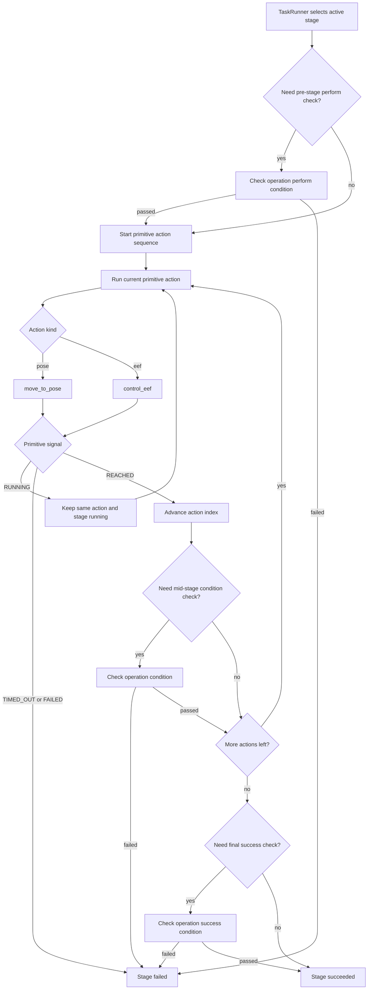

# Execution Completion Flow

This document explains how `pre_move`, `eef`, and `post_move` are executed, how each primitive action decides that it is "done", and how that relates to stage-level success or failure.

The short version is:

- `pre_move` and `post_move` are both primitive `pose` actions.
- `eef` is a primitive gripper action.
- Each primitive action decides its own completion first.
- The task runner then uses that primitive result to decide whether to continue the stage, fail the stage, or mark the stage successful.
- Stage success is therefore built on primitive completion, but it is not identical to primitive completion.

## Execution Layers

There are two layers involved:

1. Primitive action execution
   - Implemented by backend handlers such as `MujocoOperatorHandler.move_to_pose()` and `MujocoOperatorHandler.control_eef()`.
   - Produces `ControlSignal.RUNNING`, `REACHED`, `TIMED_OUT`, or `FAILED`.
2. Stage execution
   - Implemented by `TaskRunner`.
   - Consumes primitive action results and decides whether to:
     - keep the current action running
     - advance to the next action in the stage
     - fail the stage
     - mark the stage as succeeded

## How A Stage Becomes Actions

`TaskFlowBuilder.build_actions()` expands one stage into a sequence of primitive actions:

- `pre_move` entries become one or more `pose` actions
- `eef` becomes one `eef` action when the operation requires it
- `post_move` entries become one or more `pose` actions

Typical sequences:

- `move`: `pre_move`
- `grasp`: `eef`
- `release`: `eef`
- `pick`: `pre_move -> eef -> post_move`
- `place`: `pre_move -> eef -> post_move`
- `push`: `pre_move -> post_move` and optionally `eef`
- `pull`: `pre_move -> eef -> post_move`
- `press`: `pre_move -> eef -> post_move`

The runner maps the active primitive action into a phase label:

- actions before the first `eef` action are `pre_move`
- the `eef` action itself is `eef`
- actions after the `eef` action are `post_move`

## Primitive Completion Rules

### `pre_move` / `post_move`

Both are handled by `MujocoOperatorHandler.move_to_pose()`.

For each control tick, the backend:

1. Resolves the target world pose for the current primitive action
2. Commands the operator toward that target
3. Measures the end-effector pose after stepping
4. Computes:
   - position error
   - orientation error

The primitive pose action is considered complete only when both are within tolerance:

```text
position_error <= control.tolerance.position
orientation_error <= control.tolerance.orientation
```

If that happens, the backend returns:

- `ControlSignal.REACHED`

If the action runs too long:

- `ControlSignal.TIMED_OUT`

Otherwise:

- `ControlSignal.RUNNING`

### `eef`

Handled by `MujocoOperatorHandler.control_eef()`.

The backend first commands the gripper target, then checks whether the requested open/close action has effectively finished.

When `close=True`:

- If enough settle steps have elapsed and the target object is judged grasped, the primitive returns `REACHED`
- Otherwise, if the gripper joint has closed sufficiently near the target position, it also returns `REACHED`
- Otherwise it remains `RUNNING`

When `close=False`:

- If the gripper joint has opened sufficiently, the primitive returns `REACHED`
- Otherwise it remains `RUNNING`

If the action exceeds the timeout:

- `ControlSignal.TIMED_OUT`

So for `eef`, "done" can mean either:

- a semantic success-like event such as "object is grasped"
- or a lower-level actuator/joint threshold was reached

That distinction matters because stage success may still require an additional stage-condition check.

## Stage Progression Rules

`TaskRunner._update_env()` processes one primitive action at a time.

For the active primitive action:

- `RUNNING`
  - stage remains running
  - runner keeps the same action index
- `REACHED`
  - runner advances to the next primitive action
  - in some operations, runner immediately checks an operation condition before continuing
- `TIMED_OUT` or `FAILED`
  - runner marks the whole stage as failed

This means primitive completion is a prerequisite for stage progression, but it is not the same thing as stage completion.

## Where Stage Conditions Are Checked

Stage conditions are defined by `OPERATION_CONDITIONS` and evaluated by `TaskRunner._check_stage_condition()`.

The key idea is:

- primitive actions answer "did this low-level command finish?"
- stage conditions answer "did this operation achieve the required semantic state?"

Examples:

- `pick`
  - perform condition: `released`
  - success condition: `grasped`
- `place`
  - perform condition: `grasped`
  - success condition: `released`
- `push`
  - success condition: `displaced`
- `pull`
  - perform condition: `grasped`
  - success condition: `grasped`
- `press`
  - success condition: `contacted`

## Coupling Between Primitive Completion And Stage Completion

They are coupled, but not merged into one rule set.

What is coupled:

- the stage cannot advance until the current primitive action returns `REACHED`
- primitive timeout or failure immediately fails the stage

What is separate:

- a primitive action can return `REACHED`, but the stage can still fail its semantic condition check
- stage success depends on operation-specific conditions, not only on primitive completion

So the relationship is:

- primitive completion drives control flow
- stage conditions decide semantic success

## Operation-Specific Timing

### `move`

- No pre-condition
- Stage success uses the post-condition `reached`
- `reached` means the end-effector is within tolerance of the final target pose

### `grasp`

- Stage runs only `eef`
- Before execution, runner checks `released`
- After `eef` reaches completion, runner checks `grasped`

### `release`

- Stage runs only `eef`
- Before execution, runner checks `grasped`
- After `eef` reaches completion, runner checks `released`

### `pick`

- Stage runs `pre_move -> eef -> post_move`
- Before stage start, runner checks `released`
- After `eef`, runner may immediately fail if the operator is still not grasping anything
- After the full stage finishes, runner checks `grasped`

This means `eef` completion alone does not guarantee `pick` success.

### `place`

- Stage runs `pre_move -> eef -> post_move`
- Before stage start, runner checks `grasped`
- After the full stage finishes, runner checks `released`

So opening the gripper may be "done" at the primitive level, but the stage can still fail if the object is still effectively grasped afterward.

### `pull`

- Stage runs `pre_move -> eef -> post_move`
- The normal pre-stage perform check is skipped
- After `eef`, runner immediately checks `PERFORM = grasped`
- After `post_move`, runner checks `SUCCESS = grasped`

This is the most explicit example of primitive completion being separate from stage semantics:

- `eef` can be mechanically complete
- but if the object was not actually grasped, the stage fails before `post_move` continues

### `press`

- Stage runs `pre_move -> eef -> post_move`
- After `eef`, runner immediately checks `SUCCESS = contacted`
- Final stage success is decided from that mid-stage contact check rather than a final post-stage success check

## Flowchart



## Practical Takeaways

- `pre_move` and `post_move` completion are purely pose-tolerance based in the MuJoCo backend.
- `eef` completion is gripper-state based, with special grasp detection when closing on a target object.
- Primitive `REACHED` does not always mean the stage has semantically succeeded.
- Stage success depends on operation-specific condition checks such as `grasped`, `released`, `contacted`, or `displaced`.
- If you are debugging an execution, inspect both:
  - primitive action details in `TaskUpdate.details`
  - stage-condition failures recorded by `TaskRunner`

## Related Files

- `auto_atom/backend/mjc/mujoco_backend.py`
- `auto_atom/runtime.py`
- `auto_atom/framework.py`
- `docs/mujoco_backend_conditions.md`
