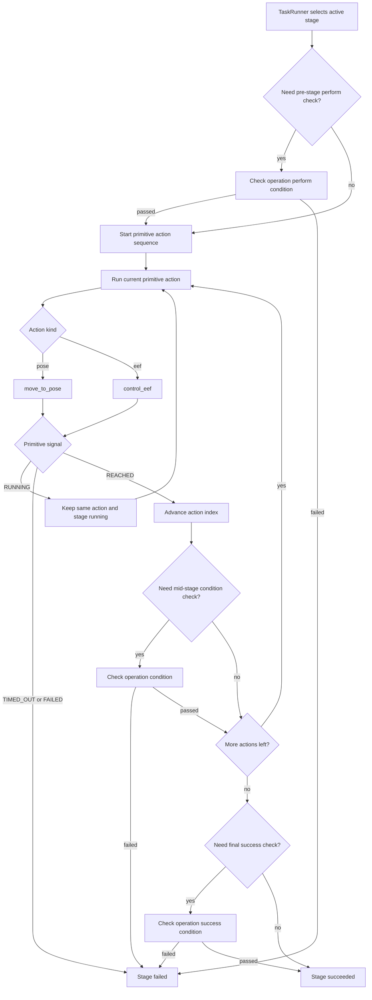

# Execution Completion Flow

This document explains how `pre_move`, `eef`, and `post_move` are executed, how each primitive action decides that it is "done", and how that relates to stage-level success or failure.

The short version is:

- `pre_move` and `post_move` are both primitive `pose` actions.
- `eef` is a primitive gripper action.
- Each primitive action decides its own completion first.
- The task runner then uses that primitive result to decide whether to continue the stage, fail the stage, or mark the stage successful.
- Stage success is therefore built on primitive completion, but it is not identical to primitive completion.

## Execution Layers

There are two layers involved:

1. Primitive action execution
   - Implemented by backend handlers such as `MujocoOperatorHandler.move_to_pose()` and `MujocoOperatorHandler.control_eef()`.
   - Produces `ControlSignal.RUNNING`, `REACHED`, `TIMED_OUT`, or `FAILED`.
2. Stage execution
   - Implemented by the shared `StageExecution` module.
   - `TaskRunner` supplies backend primitive results; `PolicyEvaluator` supplies
     policy feedback without changing external model actions.
   - Consumes primitive action results and decides whether to:
     - keep the current action running
     - advance to the next action in the stage
     - fail the stage
     - mark the stage as succeeded

Before either adapter starts a Stage, the `ExecutionTimeline` compiles the
validated task's static `Stage → Keypoint → Primitive` ordering once. It owns
keypoint identity and before/after interval boundaries; runtime action lists
are still deep-copied lazily per environment and stage. Waypoint randomization,
pose resolution, arc snapshots, and controller cursors therefore remain
runtime state rather than eager preprocessing.

## How A Stage Becomes Actions

`TaskFlowBuilder.build_actions()` expands one stage into a sequence of primitive actions:

- `pre_move` entries become one or more `pose` actions
- `eef` becomes one `eef` action when the operation requires it
- `post_move` entries become one or more `pose` actions

The phase contract is summarized below.  “Optional” means that the phase is
executed when configured; “generated” means the runner creates the primitive
even when the corresponding `param` entry is omitted.

| Operation | `pre_move` | `eef` | `post_move` | Runtime sequence |
| --- | --- | --- | --- | --- |
| `move` | **Required** (at least one pose) | Ignored, even if configured | Optional | `pre_move+ -> post_move*` |
| `grasp` | Optional | **Generated** close action (or configured `eef`) | Optional | `pre_move* -> eef -> post_move*` |
| `release` | Optional | **Generated** open action (or configured `eef`) | Optional | `pre_move* -> eef -> post_move*` |
| `pick` | Optional | **Generated** target-verified close action (or configured `eef`) | Optional | `pre_move* -> eef -> post_move*` |
| `place` | Optional | **Generated** open action (or configured `eef`) | Optional | `pre_move* -> eef -> post_move*` |
| `push` | **Required** (at least one pose) | Optional; only configured `eef` runs | Optional | `pre_move+ -> eef? -> post_move*` |
| `pull` | Optional | **Generated** target-verified close action (or configured `eef`) | Optional | `pre_move* -> eef -> post_move*` |
| `press` | **Required** (at least one pose) | **Generated** close action (or configured `eef`) | Optional | `pre_move+ -> eef -> post_move*` |

In the sequence column, `+` means one or more configured waypoints, `*` means
zero or more, and `?` marks an optional singleton phase.

For `grasp`, `release`, `place`, and `press`, an explicit `param.eef` replaces
the operation's default command.  For `pick` and `pull`, an explicit EEF can
customize the closing command, but target-grasp completion is intrinsic: the
runner enforces `require_grasp: true` on that closing primitive and retains the
other configured fields.  An opening EEF override is rejected for these two
operations. `require_grasp: true` remains available to add the same
target-specific primitive check to other operations with an explicit EEF. It
is only valid on a closing command.  A `pick` or `pull` post-move cannot use
`object_world`, or `auto` when the stage has an object, because that target
would chase the grasped object.  Use `eef_world` for the usual fixed-world
retreat target.

Each primitive action keeps the configured phase and YAML waypoint index from
which it was built:

- `pre_move` entries are labelled `pre_move` with their list index
- the single end-effector action is labelled `eef` / waypoint `0`
- `post_move` entries are labelled `post_move` with their own list index

This explicit identity matters for stages without an `eef` action and for arc
waypoints that expand into several internal primitive actions.

## Primitive Completion Rules

### `pre_move` / `post_move`

Both are handled by `MujocoOperatorHandler.move_to_pose()`.

For each control tick, the backend:

1. Resolves the target world pose for the current primitive action
2. Commands the operator toward that target
3. Measures the end-effector pose after stepping
4. Computes:
   - position error
   - orientation error

The primitive pose action is considered complete only when both are within tolerance:

```text
position_error <= control.tolerance.position
orientation_error <= control.tolerance.orientation
```

If that happens, the backend returns:

- `ControlSignal.REACHED`

If the action runs too long:

- `ControlSignal.TIMED_OUT`

Otherwise:

- `ControlSignal.RUNNING`

### `eef`

Handled by `MujocoOperatorHandler.control_eef()`.

The backend first commands the gripper target, then checks whether the requested open/close action has effectively finished.

When `close=True`:

- If enough settle steps have elapsed and the target object is judged grasped, the primitive returns `REACHED`
- Otherwise, if the gripper joint has closed sufficiently near the target position, it also returns `REACHED`
- Otherwise it remains `RUNNING`

When `close=False`:

- If the gripper joint has opened sufficiently, the primitive returns `REACHED`
- Otherwise it remains `RUNNING`

If the action exceeds the timeout:

- `ControlSignal.TIMED_OUT`

So for `eef`, "done" can mean either:

- a semantic success-like event such as "object is grasped"
- or a lower-level actuator/joint threshold was reached

That distinction matters because stage success may still require an additional stage-condition check.

## Stage Progression Rules

`StageExecution` processes one primitive action result at a time. `TaskRunner`
invokes the active primitive through its backend adapter before handing the
result to that shared state machine.

For the active primitive action:

- `RUNNING`
  - stage remains running
  - runner keeps the same action index
- `REACHED`
  - runner advances to the next primitive action
  - in some operations, runner immediately checks an operation condition before continuing
- `TIMED_OUT` or `FAILED`
  - runner marks the whole stage as failed

This means primitive completion is a prerequisite for stage progression, but it is not the same thing as stage completion.

`TaskRunner.update()` can compose these controller updates into a larger public
step through `execution.update_boundary`:

| Boundary | One public `update()` returns after |
| --- | --- |
| `control_tick` | One controller update (default, backward-compatible behavior) |
| `primitive` | The active runtime primitive reaches completion |
| `keypoint` | The active YAML waypoint reaches completion |
| `stage` | The active stage reaches successful completion |

A YAML waypoint and a runtime primitive are usually the same boundary, but an
arc waypoint can expand into several primitives. `primitive` returns after
each arc sub-action; `keypoint` returns only after the final sub-action for
that YAML waypoint. `stage` also waits for the stage's semantic condition
checks described below.

When using a custom `TaskFlowBuilder` with
`execution.update_boundary: keypoint`, every emitted `PrimitiveAction` must
define a valid configured `phase` and `waypoint`. If several primitives belong
to one keypoint (for example, arc sub-actions), they must be contiguous and
only the final one may set `completes_keypoint=True`. Interval selection uses
the same contract. `TaskRunner.from_config()` validates this before execution
and fails fast with `ValueError`, because the runner otherwise cannot determine
a stable YAML keypoint boundary. Override `build_actions()` to customize this
compiled primitive sequence; Stage order and identity come from the task config.

Macro boundaries do not teleport or bypass the state machine. They repeat the
same control flow internally, up to
`execution.max_internal_updates_per_update` controller updates per selected
environment (default `10000`). Reaching this limit is an explicit terminal
failure. In a batch, each environment stops at its own first requested
boundary, so a faster environment never crosses an extra boundary while
another catches up.

`execution.render_internal_updates: false` can hide those internal ticks from
the passive viewer without removing them from this flow. Viewer refresh and
`step_delay` are suppressed inside one public call, followed by one delay-free
refresh at its final boundary. Physics, conditions, camera observations, and
the internal-update counters are unchanged.

## Where Stage Conditions Are Checked

Stage conditions are defined by `OPERATION_CONDITIONS` and evaluated by the
shared `stage_execution.check_stage_condition()` function under
`StageExecution`.

The key idea is:

- primitive actions answer "did this low-level command finish?"
- stage conditions answer "did this operation achieve the required semantic state?"

## Atomic operations

The phase table above describes primitive construction.  This second table
records the semantic condition contract and its actual check point for the
configured primitive sequence used by `TaskRunner` and
`ConfigDrivenDemoPolicy`.  A condition is evaluated by the shared stage state
machine; the active backend defines how each predicate is measured.

`pull` and `push` name condition contracts, not geometric directions.  Choose
between them according to the state that must be verified: `pull` establishes
or confirms a grasp of the Stage target after `eef` and requires the same
target to remain grasped through the effect trajectory, while `push` requires
target displacement and imposes no grasp condition.  A motion commonly
described as pushing—or as neither pulling nor pushing—can therefore be
configured as `pull` when the target-grasp-retention contract is the intended
one.

> **Compatibility**: `pick` and `pull` no longer accept a grasp of some other
> registered object as satisfying their `grasped` condition.  Custom backends
> must implement `is_object_grasped(operator, stage.object)` accurately; task
> configs should remove redundant `require_grasp: true` entries from these two
> operations.

| Operation | Perform condition and timing | Success condition and timing |
| --- | --- | --- |
| `move` | None | `reached` after the final primitive (the last `post_move`, or the last `pre_move` when no post-move exists). |
| `grasp` | `released` before the stage, before optional moves | `grasped` after the final primitive. |
| `release` | `grasped` before the stage, before optional moves | `released` after the final primitive. |
| `pick` | `released` before the stage | The Stage target is `grasped` after the final primitive; the EEF primitive itself also waits for that target-specific grasp. |
| `place` | `grasped` before the stage | `placed` after the final primitive, including release and any placement-tolerance check for the held object. |
| `push` | None | `displaced` after the final primitive (normally after `post_move`). |
| `pull` | The stage-start check is intentionally skipped; the Stage target must be `grasped` immediately after `eef`, before `post_move` | The same Stage target is `grasped` again after the final primitive. |
| `press` | None | `contacted` immediately after `eef`, before optional `post_move`; the successful contact is not rechecked at stage end. |

> **Note**: The final target-specific `grasped` check is currently mandatory for
> `pull`.  A future configuration option may allow a task to omit that final
> check, but no such option exists today.

`placed` combines release with the held object's target pose when a target and
configured tolerance are available.  `displaced` compares the stage object's
current position with its stage-start position and uses
`param.displacement_threshold` when supplied.  `reached` checks both position
and orientation tolerance for the stage's completion pose.

### Condition vocabulary

| Condition | Meaning |
| --- | --- |
| `released` | The operator is not currently grasping any object. |
| `grasped` | The operator is currently grasping an object.  `pick` and `pull` intrinsically narrow this condition to their Stage target; an explicit EEF on another operation can request the same target-specific primitive check with `require_grasp: true`. |
| `contacted` | The backend reports that the operator is in contact with the stage target object. |
| `displaced` | The target object's position moved beyond the configured displacement threshold from its initial stage pose. |
| `reached` | The EEF is within position and orientation tolerances of the final target pose. |
| `placed` | The operator has released the held object and, when placement checking is configured, that object is within the selected target tolerances. |

See [MuJoCo Backend Condition Constraints](../mujoco-backend/mujoco_backend_conditions.md)
for contact detection, tolerance resolution, and failure diagnostics.

An external policy that supplies only stage-level feedback has no configured
`eef` keypoint.  In that mode, success is checked at the policy's reported
stage-action boundary, or while polling the current stage when no explicit
feedback boundary is supplied; the `eef`-specific timing in the table does not
apply.

## Coupling Between Primitive Completion And Stage Completion

They are coupled, but not merged into one rule set.

What is coupled:

- the stage cannot advance until the current primitive action returns `REACHED`
- primitive timeout or failure immediately fails the stage

What is separate:

- a primitive action can return `REACHED`, but the stage can still fail its semantic condition check
- stage success depends on operation-specific conditions, not only on primitive completion

So the relationship is:

- primitive completion drives control flow
- stage conditions decide semantic success

## Interval boundaries

When `execution.interval_selection` is configured, the same completion flow is
reused for both endpoints:

1. `reset()` repeatedly performs normal internal control updates until it
   reaches the configured `start` boundary.
2. With `start.side: before`, reset stops immediately before executing the
   start keypoint. With `start.side: after`, it executes the whole
   keypoint and any condition attached to its completion before returning.
3. Public updates continue normally until the configured `stop` boundary.
4. With `stop.side: before`, the environment reports success without
   executing the stop keypoint or its completion condition. With
   `stop.side: after`, it first completes both and then reports success.

`start.side` defaults to `before`; `stop.side` defaults to `after`.
These values directly describe concrete states around a keypoint. Interval
stop takes priority over a
coarser `execution.update_boundary`: a stop boundary in the middle of a stage,
for example, returns without completing the rest of that stage even when the
boundary is `stage`.

Boundary order is `before(K0) < after(K0) < before(K1) < after(K1) ...`.
Thus the same keypoint with `before -> after` executes that one keypoint;
`before -> before` or `after -> after` is an empty interval completed during
reset; and `after -> before` is rejected. Since `after(K)` and
`before(next K)` share one physical state, that adjacent pair is also empty.

Reset fast-forward and public macro updates have independent safeguards:

- `execution.interval_selection.max_fast_forward_updates` limits controller
  updates used by `reset()` to reach `start` (default `10000`).
- `execution.max_internal_updates_per_update` limits controller updates made by
  one public `update()` (default `10000`).

See
[Stages & Waypoints](stages_and_waypoints.md#task-interval-boundary-selection)
for the schema, validation, and reporting details.

## Flowchart



## Practical Takeaways

- `pre_move` and `post_move` completion are purely pose-tolerance based in the MuJoCo backend.
- `eef` completion is gripper-state based, with special grasp detection when closing on a target object.
- Primitive `REACHED` does not always mean the stage has semantically succeeded.
- Stage success depends on operation-specific condition checks such as `grasped`, `released`, `placed`, `contacted`, or `displaced`.
- If you are debugging an execution, inspect both:
  - primitive action details in `TaskUpdate.details`
  - stage-condition failures recorded by `TaskRunner`

## Related Files

- `auto_atom/backend/mjc/mujoco_backend.py`
- `auto_atom/runtime.py`
- `auto_atom/framework.py`
- `docs/mujoco-backend/mujoco_backend_conditions.md`
